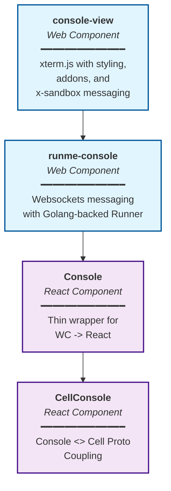

## Architecture Diagram

Simple depiction of the web and react components.

```mermaid
flowchart TD
    A["<b>console-view</b><br/><i>Web Component</i><br/>━━━━━━━━━━━━━━<br/>xterm.js with styling,<br/>addons, and<br/>x-sandbox messaging"]
    B["<b>runme-console</b><br/><i>Web Component</i><br/>━━━━━━━━━━━━━━<br/>Websockets messaging<br/>with Golang-backed Runner"]
    C["<b>Console</b><br/><i>React Component</i><br/>━━━━━━━━━━━━━━<br/>Thin wrapper for<br/>WC -&gt; React"]
    D["<b>CellConsole</b><br/><i>React Component</i><br/>━━━━━━━━━━━━━━<br/>Console &lt;&gt; Cell Proto<br/>Coupling"]

    A --> B
    B --> C
    C --> D

    classDef webc fill:#e1f5ff,stroke:#01579b,stroke-width:2px
    classDef reactc fill:#f3e5f5,stroke:#4a148c,stroke-width:2px

    class A,B webc
    class C,D reactc
```
