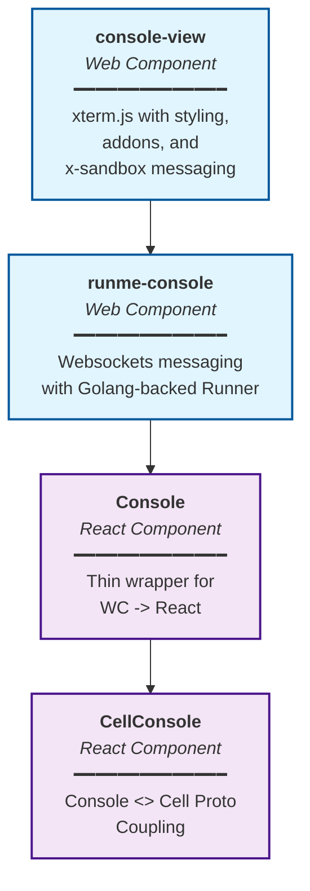

# CLAUDE.md

This file provides guidance to Claude Code (claude.ai/code) when working with code in this repository.

## Prerequisites

This project uses [Runme](https://runme.dev/) to execute tasks defined in markdown files. Install Runme before proceeding:

```bash
# via npm
npm install -g runme
```

```bash
# or via Homebrew (macOS/Linux)
brew install runme
```

See [runme.dev](https://runme.dev/) for other installation options.

## Build & Development Commands

Use `runme run <task>` to execute tasks defined in README.md:

| Command               | Description                                                 |
| --------------------- | ----------------------------------------------------------- |
| `runme run configure` | Set up pnpm to use Buf registry                             |
| `runme run setup`     | Install all dependencies                                    |
| `runme run build`     | Build all packages                                          |
| `runme run dev`       | Start development server (builds renderers + console first) |
| `runme run test`      | Run tests (requires build first)                            |
| `runme run clean`     | Clean build artifacts                                       |

**IMPORTANT**: After making code changes, you MUST run `runme run build test` to ensure everything works correctly.

See [README.md](README.md) for additional build and test commands.

## Git Commit Requirements

**IMPORTANT**: This project requires all contributors to sign off on the Developer Certificate of Origin (DCO) as required by CNCF/LF.

You MUST use the `-s` flag with every git commit:

```bash
git commit -s -m "Your commit message"
```

This adds a "Signed-off-by" line to your commit message, certifying that you have the right to submit the code under the project's license.

**Never commit without the `-s` flag.** Commits without DCO signoff cannot be merged.

## Pull Request Requirements

When you open a follow-up PR that fixes an issue, include an issue-closing reference in the PR description so GitHub auto-closes the issue on merge.

- Use one of GitHub's auto-close keywords with an issue number, for example: `Fixes #123`, `Closes #123`, or `Resolves #123`.
- Put this in the PR body (not just a comment) so the issue is linked and automatically closed when the PR merges.

## Architecture

This is a pnpm workspace monorepo with two publishable packages and one app:

| Package                     | Description                                                   |
| --------------------------- | ------------------------------------------------------------- |
| **app/**                    | Main Vite+React 19 SPA - uses packages below                  |
| **@runmedev/react-console** | React wrapper for `<runme-console>` web component             |
| **@runmedev/renderers**     | Lit.js web components + xterm.js terminal + WebSocket streams |

**Build order matters**: `renderers` → `console` → `app`

### Key App Directories

- **`app/src/routes/`** - React Router v7 route definitions
- **`app/src/components/`** - Main UI components (MainPage, Actions, SidePanel, etc.)
- **`app/src/contexts/`** - React Context providers for app state
- **`app/src/storage/`** - Storage implementations (Google Drive, filesystem, HTTP API, local)
- **`app/src/lib/`** - Utility libraries and hooks

### Package Entry Points

- `packages/renderers/src/index.ts` - Web components, Streams class, messaging utilities
- `packages/react-console/src/index.tsx` - Console React component wrapper

### Web + React Component Stack

The console architecture builds from low-level web components up to high-level React components: `console-view` (xterm.js terminal) is wrapped by `runme-console` (WebSocket orchestration), which is wrapped by the React `Console` component, which is finally integrated into `CellConsole` for notebook cell execution.



## Technology Stack

- **React 19** with TypeScript
- **React Router v7** for routing
- **Radix UI** themes and primitives
- **xterm.js** for terminal emulation (in renderers)
- **Monaco Editor** for code editing
- **ConnectRPC** for RPC communication
- **Lit.js** for web components (in renderers)
- **Vite** for build tooling
- **Tailwind CSS** for styling
- **Vitest** for testing
- **Dexie/IndexedDB** for local storage

## Storage Backends

The app supports multiple notebook storage backends:

- `DriveNotebookStore` - Google Drive via GAPI
- `FilesystemNotebookStore` - Browser File System Access API
- `ContentsNotebookStore` - HTTP API via agent endpoint
- `LocalNotebooks` - In-memory session storage

## Protobuf Types

Types are generated from buf.build registries:

- `@buf/runmedev_runme.bufbuild_es` - Core Runme types
- `@buf/googleapis_googleapis.bufbuild_es` - Google API types
