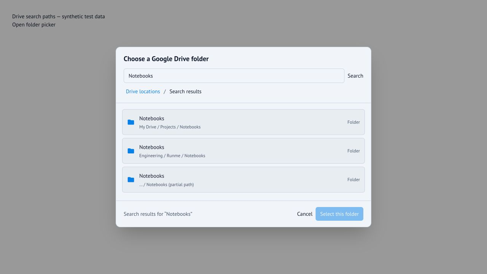

# Disambiguate Google Drive search results

The production folder and file picker displays a full path below each search
match. Paths load progressively; inaccessible ancestry is labeled partial.
Selection uses Drive IDs, including when full paths themselves collide.

## Reproduce with synthetic data

1. Run `go run testing/drive-paths/main.go` from the repository root.
2. Run `pnpm -C app dev --host 127.0.0.1 --port 5186`.
3. Open `http://127.0.0.1:5186/test/fixtures/drive-paths.html`.
4. Search for `Notebooks`.
5. Verify three independently selectable rows with these descriptions:
   - `My Drive / Projects / Notebooks`
   - `Engineering / Runme / Notebooks`
   - `… / Notebooks (partial path)`
6. Open the Engineering result, then choose **Select this folder**.
7. Verify the page reports `Selected ID: team-notebooks`.
8. Reopen the picker and use keyboard focus to inspect path descriptions.

The fixture imports the production React dialog and resolver and sends real
HTTP requests to a read-only Go fixture. Its token and data are synthetic.
The fixture is a Vite development entry point, not a production app route.
Save screenshots and assertion transcripts under `app/test/browser/test-output/`.

## Verified UI

## Regression coverage

- `googleDriveBrowser.test.ts`: search requests and preserves parent IDs;
  shortcut source parents are not attached to target IDs.
- `googleDrivePaths.test.ts`: root naming, shared-ancestor request deduplication,
  result-metadata reuse, target resource keys, inaccessible/malformed ancestors,
  cycle/depth limits, bounded concurrency, timeout and cancellation.
- `GoogleDriveResourcePickerDialog.test.tsx`: progressive path descriptions and
  stale callback rejection after search, navigation, token changes and unmount.

The design and implementation record is in
[20261003_google_drive_full_paths.runme](https://web.runme.dev/?doc=https%3A%2F%2Fdrive.google.com%2Ffile%2Fd%2F100i8UJfmZyvqw-1UxFiIs5pxM2Nt79oC%2Fview).
