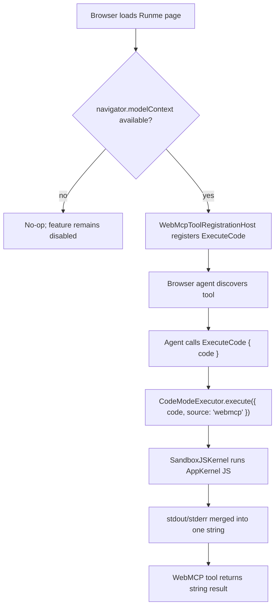

# 20260510 WebMCP Tool Support

## Status

Draft proposal.

## Summary

Add WebMCP support to the web app by registering one browser tool through
`navigator.modelContext.registerTool(...)` when the API is available.

The tool will reuse the existing AppKernel code-mode path:

- input: `{ code: string }`
- execution: AppKernel sandbox
- result: one merged stdout/stderr string

We will not add a new execution stack, a new backend endpoint, or a WebMCP-only
tool contract. The main work is registration, lifecycle management, and
reusing the existing browser executor outside `ChatKitPanel`.

## Goals

- Expose one WebMCP tool to browser agents.
- Reuse the existing sandbox `CodeModeExecutor`.
- Keep the tool contract aligned with the existing `ExecuteCode` capability.
- Register the tool only when WebMCP is actually available in the browser.
- Keep the feature inert in browsers that do not implement WebMCP.

## Non-Goals

- Supporting multiple WebMCP tools in v0.
- Adding a backend or MCP transport for WebMCP.
- Replacing the existing ChatKit, Responses, or Codex tool paths.
- Designing a confirmation UI for tool execution in v0.
- Using declarative WebMCP. We only need imperative registration.

## Relevant Current State

The execution path already exists.

- `app/src/lib/runtime/codeModeExecutor.ts` executes JavaScript in AppKernel,
  defaults to sandbox mode, merges stdout/stderr, enforces timeout and output
  limits, and returns `{ output: string }`.
- `app/src/lib/runtime/notebookToolHandlers.ts` already routes existing
  `ExecuteCode`-style tool calls to `CodeModeExecutor`.
- `app/src/lib/runtime/responsesDirectChatKitAdapter.ts` already defines a
  single browser-local `ExecuteCode` tool for Responses.
- `app/src/components/ChatKit/ChatKitPanel.tsx` already knows how to resolve
  the current notebook and open notebook list, then build a shared
  `CodeModeExecutor`.

The missing piece is a browser-global registration path that is not coupled to
opening the AI panel.

## Why WebMCP Fits This Architecture

The WebMCP spec is a browser API for exposing site-defined tools to browser
agents. The current draft published on April 23, 2026 defines:

- `navigator.modelContext` on `Navigator`
- `modelContext.registerTool(tool, options?)`
- imperative tool registration with a JSON-schema-like `inputSchema`
- `AbortSignal`-driven unregistration

That maps cleanly onto Runme's existing browser-local tool execution model. We
already execute code in-browser and already have a narrow single-tool contract.
WebMCP only needs a registration shell around that executor.

## Proposal

### Tool shape

Register one tool named `ExecuteCode`.

Reason:

- the name already exists in `responsesDirectChatKitAdapter.ts`
- the user asked for one execute-code tool
- reusing the same name reduces drift across browser-agent entry points

Proposed WebMCP registration object:

```ts
const tool = {
  name: "ExecuteCode",
  title: "Runme Execute Code",
  description:
    "Execute JavaScript in the Runme AppKernel sandbox and return one merged stdout/stderr string.",
  inputSchema: {
    type: "object",
    additionalProperties: false,
    properties: {
      code: { type: "string" },
    },
    required: ["code"],
  },
  annotations: {
    readOnlyHint: false,
    untrustedContentHint: true,
  },
  async execute(input: { code: string }) {
    const result = await codeModeExecutor.execute({
      code: input.code,
      source: "webmcp",
    });
    return result.output;
  },
};
```

Notes:

- `readOnlyHint` is false because executed code can mutate notebook state.
- `untrustedContentHint` should be true because the returned string may contain
  notebook content, network content, or arbitrary program output emitted by the
  executed code.
- The external WebMCP return value is a string. Internally we still reuse
  `CodeModeExecutor` and its `{ output }` result.

### Availability check

Register only when all of these are true:

```ts
const isWebMcpAvailable =
  typeof navigator !== "undefined" &&
  typeof navigator.modelContext !== "undefined" &&
  typeof navigator.modelContext?.registerTool === "function";
```

`navigator.modelContext` presence is the right first gate. Checking
`registerTool` as a function keeps the detection resilient to partial or
experimental browser implementations.

The spec marks `navigator.modelContext` as a secure-context API. In practice,
that means this should only work where the browser exposes it, typically under
HTTPS or localhost-style development contexts.

If the check fails, do nothing and log one debug event.

### Registration lifecycle

Register once near the app root, not inside `ChatKitPanel`.

Reason:

- WebMCP is a page capability, not an AI-panel capability.
- Browser agents should be able to discover the tool whenever the app is open.
- `ChatKitPanel` may never mount in a session.

Use `AbortController` so cleanup automatically unregisters the tool:

```ts
const controller = new AbortController();
navigator.modelContext.registerTool(tool, { signal: controller.signal });
return () => controller.abort();
```

This follows the spec and keeps dev/HMR behavior manageable.

### Execution ownership

We should not duplicate the notebook-resolution logic currently embedded in
`ChatKitPanel`.

Instead, extract the shared executor setup into a reusable hook or helper, for
example:

```ts
type UseCodeModeExecutorOptions = {
  mode?: "browser" | "sandbox";
};

function useCodeModeExecutor(
  options?: UseCodeModeExecutorOptions,
): CodeModeExecutor;
```

This hook should own:

- resolving the current notebook from `CurrentDocContext`
- enumerating open notebooks from `NotebookContext`
- adapting `NotebookData` into the `NotebookDataLike` shape expected by
  `createCodeModeExecutor(...)`

Then:

- `ChatKitPanel` uses the shared hook
- the new WebMCP registration host uses the same hook

That is the main code reuse win in this design.

## Proposed Components

### 1. Shared tool-definition module

Add a small shared module for the execute-code tool metadata so Responses and
WebMCP do not drift.

Example:

```ts
export const EXECUTE_CODE_TOOL_NAME = "ExecuteCode";

export function buildExecuteCodeInputSchema() {
  return {
    type: "object",
    additionalProperties: false,
    properties: {
      code: { type: "string" },
    },
    required: ["code"],
  };
}

export function getExecuteCodeDescription(): string {
  return "Execute JavaScript in the Runme AppKernel sandbox and return one merged stdout/stderr string.";
}
```

Consumers:

- `responsesDirectChatKitAdapter.ts`
- new WebMCP registrar

We do not need to refactor the proto-based Codex bridge in this change.

### 1a. Explicit source for logs

Extend `CodeModeSource` in `codeModeExecutor.ts` from:

```ts
type CodeModeSource = "chatkit" | "codex";
```

to:

```ts
type CodeModeSource = "chatkit" | "codex" | "webmcp";
```

This is not required for functionality, but it makes logs and future metrics
honest. WebMCP should not be reported as ChatKit traffic.

### 2. Shared executor hook

Extract the executor-building logic from `ChatKitPanel.tsx` into a reusable hook
under `app/src/lib/runtime/`, for example:

- `useCodeModeExecutor.ts`

This should wrap `createCodeModeExecutor(...)` and keep the current behavior:

- sandbox mode by default
- current notebook fallback
- access to all open notebooks

### 3. WebMCP registration host

Add a small React host component, for example:

- `app/src/components/WebMcp/WebMcpToolRegistrationHost.tsx`

Responsibilities:

- feature-detect WebMCP
- build the shared `CodeModeExecutor`
- call `registerTool(...)` in an effect
- unregister on cleanup
- emit structured logs

Mount it once inside `App.tsx` after the notebook/current-doc providers are
available.

Recommended placement:

```tsx
<NotebookProvider>
  <WebMcpToolRegistrationHost />
  <SidePanelProvider>
    <GlobalToast />
    <AppRouter />
  </SidePanelProvider>
</NotebookProvider>
```

This keeps registration independent of the side panel while preserving access
to notebook state.

## Execution Flow



## Error Handling And Limits

We should keep the same runtime limits already enforced by
`createCodeModeExecutor(...)`.

Current defaults:

- timeout: 15 seconds
- max output: 256 KB
- max code payload: 64 KB

Behavior:

- normal completion returns the merged output string
- execution failure throws, while preserving partial output inside the executor
- WebMCP callback should convert failures into a returned string only if the
  browser agent ecosystem proves incompatible with thrown tool errors

Recommendation for v0:

- start by letting the callback throw on execution failure
- include structured logs with `source: "webmcp"`
- only add special error wrapping if a target browser requires it

## Security And Product Constraints

- WebMCP registration must be opt-in by browser capability, not by user-agent
  sniffing.
- Execution stays in the existing AppKernel sandbox path.
- The tool is intentionally powerful. It can read and mutate notebook state
  through the same AppKernel APIs already used by ChatKit code mode.
- We should not expose extra globals for WebMCP. It should inherit the exact
  AppKernel environment already approved for `CodeModeExecutor`.

## Backend Impact

There should be no backend work in v0.

- no new Runme endpoint
- no new MCP server registration
- no proto change required for the browser registration path
- no Codex app-server change required

This is strictly a browser-app integration that wraps existing local execution.

## Logging

Add one structured event for each of these cases:

- WebMCP unavailable
- WebMCP tool registered
- WebMCP tool unregistered
- WebMCP registration failed
- WebMCP tool execution started/completed/failed

Most execution logs already exist in `codeModeExecutor.ts`. The main gap is
using a distinct `source: "webmcp"` value.

## Test Plan

### Unit

- `isWebMcpAvailable` returns false when `navigator.modelContext` is missing
- registrar calls `registerTool(...)` once when available
- cleanup aborts the registration signal
- registered callback invokes `CodeModeExecutor.execute(...)`
- registered callback returns the merged output string

### Integration

- fake `navigator.modelContext` in jsdom and verify root registration
- verify the registered tool can call notebook helpers through the existing
  AppKernel sandbox bridge
- verify the app does nothing in browsers without WebMCP support

### Regression

- `ChatKitPanel` still uses the same shared executor after extraction
- Responses-direct `ExecuteCode` behavior remains unchanged

## Rollout

Phase 0:

- Land the shared hook and WebMCP registration behind availability detection
- no product UI required

Phase 1:

- Add light diagnostics in the Logs pane or App Console if we need easier
  debugging for early browser implementations

## Open Questions

- Should we keep the tool name `ExecuteCode`, or use a namespaced variant such
  as `runme.execute_code` for browser-agent clarity?
- Do target browser-agent implementations treat thrown tool errors better than
  stringified failure results?
- Do we want an app-level feature flag in addition to capability detection, or
  is capability detection sufficient for v0?
- Should write-capable AppKernel helpers eventually request explicit user
  interaction through `ModelContextClient.requestUserInteraction(...)` when that
  part of the spec and browser behavior stabilizes?

## Implementation Decision

We will implement WebMCP as a thin browser registration layer over the existing
sandbox code-mode executor.

We will:

- register one `ExecuteCode` tool through `navigator.modelContext`
- reuse `createCodeModeExecutor(...)`
- extract the executor setup from `ChatKitPanel` into a shared hook
- mount a root-level registration host in `App.tsx`
- no-op when `navigator.modelContext` is not defined

We will not:

- add a new backend service
- add a parallel execution runtime
- couple WebMCP registration to the AI panel

## References

- WebMCP draft, April 23, 2026: https://webmachinelearning.github.io/webmcp/
- `app/src/lib/runtime/codeModeExecutor.ts`
- `app/src/lib/runtime/notebookToolHandlers.ts`
- `app/src/lib/runtime/responsesDirectChatKitAdapter.ts`
- `app/src/components/ChatKit/ChatKitPanel.tsx`
