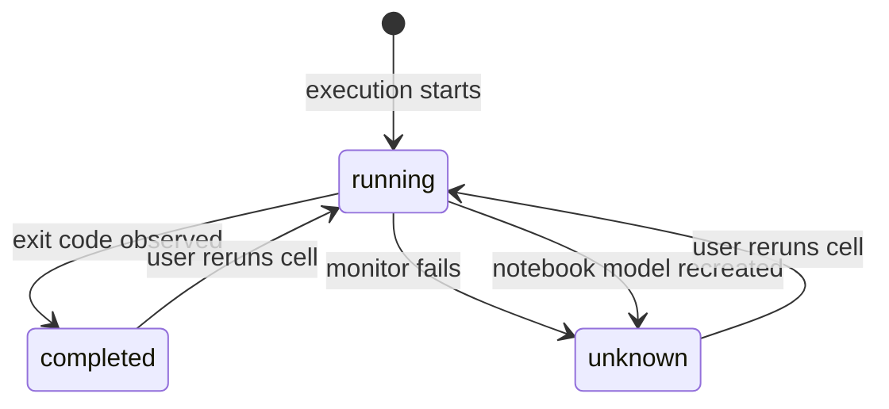

# 2026-07-15: Cell Execution Monitoring Semantics

## Status

The client-side safety fix is implemented in this change. The runner protocol
is unchanged. The protocol section below is a possible future improvement for
restoring reliable cross-session resume; it is not part of this change.

## Decision

We will not treat a persisted PID as proof that a cell is still running.

When a notebook model is recreated with a PID but no exit code, the web client
will clear the PID and record the execution outcome as `unknown`. It will not
attach a new stream for that run. The cell will explain that the process may
still be running and that the user should check the runner before repeating a
non-idempotent command.

This change does not attempt cross-session resume. A future runner protocol
could restore that capability by distinguishing a new execution from a resume
attempt and replaying a retained terminal outcome.

## Incident

Three cells in a local notebook showed as running after their commands had
finished. Each cell contained:

- `runme.dev/lastRunID`
- `runme.dev/pid`
- no `runme.dev/exitCode`

The operating-system processes no longer existed. Clearing the PIDs stopped the
running indicators, which confirmed that the UI was rendering persisted
execution metadata rather than live process state.

This state is reproducible without a real process:

1. Start a backend cell execution.
2. Deliver and persist its PID.
3. Interrupt the browser-to-runner connection before the exit response arrives.
4. Let the process finish and let the runner remove its `runID`.
5. Recreate the browser notebook model.

The old client interprets the PID as an active run and opens a WebSocket with
the old `runID`. The runner no longer has that run, so it creates a new, empty
multiplexer. That multiplexer answers heartbeats but has no process and no exit
event. The cell therefore remains active until another failure or manual
metadata repair.

## Current Contract

The web client persists three facts:

- `lastRunID` identifies an execution attempt.
- `pid` records that the runner reported a process.
- `exitCode` records an observed terminal process result.

The client currently derives liveness from `pid && !exitCode`. That inference is
valid only while the same in-memory stream owns the execution.

The runner's WebSocket handler has different semantics:

- a connection for an existing `runID` joins its multiplexer;
- a connection for an unknown `runID` creates a multiplexer;
- a completed run is removed from the in-memory map;
- responses are broadcast live and are not replayed to later connections;
- heartbeat pongs prove transport health, not process liveness.

The client therefore cannot distinguish these cases after reconnecting:

1. a quiet process is still running;
2. the process finished, but the client missed its exit response;
3. the runner restarted and forgot the execution;
4. a new empty multiplexer was created for an expired `runID`.

No client timeout can resolve this ambiguity. A timeout would classify a valid,
quiet process as dead.

## Execution State

The web client will persist `runme.dev/executionState` with these values:

| State       | Meaning                                                                                                       |
| ----------- | ------------------------------------------------------------------------------------------------------------- |
| `running`   | This browser model owns a live monitor and has not observed a terminal result.                                |
| `completed` | The monitor observed an exit code.                                                                            |
| `unknown`   | Monitoring ended or the model was recreated before an exit code was observed. The process outcome is unknown. |

`unknown` is terminal for the browser operation that awaited the run, but it is
not a process exit status. We will not synthesize exit code `0` or `1` because
either value would make an unsupported claim about the command.

The PID remains useful for display and diagnostics while an in-memory monitor
owns the run. It is cleared when that ownership is lost.



## Client Safety Fix

`NotebookData` will reconcile interrupted executions when it is constructed or
loads a replacement notebook:

1. Find cells with a PID and no exit code.
2. Preserve cells that have an execution monitor owned by this model.
3. Clear every other PID.
4. Set `executionState=unknown`.
5. Append a warning without changing the prior command output.
6. Persist the repaired metadata.

Stream errors use the same transition. This prevents `CellData.run()` and
AppKernel notebook helpers from waiting forever after monitoring has become
terminally unavailable.

This fix intentionally disables cross-session backend execution resume. The
current protocol cannot implement that feature without sometimes reporting
false liveness.

## Behavior Without a Runner Protocol Change

Normal execution monitoring is unchanged while the original in-memory notebook
model owns the stream. The cell shows as running after receiving a PID, streams
output, and becomes completed when it observes the exit code. Transient stream
reconnection can also continue while that live monitor retains its execution
context.

Once that ownership is lost, the client favors an honest loss-of-knowledge
state over a false running state:

- Loading a notebook with a PID but no exit code changes the execution to
  `unknown`; it does not open a stream for the persisted `runID`.
- A terminal monitoring error changes the execution to `unknown` and resolves
  callers waiting for the run.
- The stale PID is cleared, so the cell no longer shows a running indicator or
  accepts input for that execution.
- Existing output is preserved and a warning explains that the outcome is
  unknown. The client does not synthesize a successful or failed exit code.
- The underlying process might already have exited or might still be running
  without a client monitor. The user must inspect its effects or runner state
  before deciding whether it is safe to run the cell again.

Consequently, this change fixes indefinite false-running UI but does not provide
cross-session resume or recovery of a missed exit result. New executions are
unaffected.

## Possible Future Runner Protocol Improvement

The following is a suggested future design. It is not implemented or required
by the client safety fix in this change.

A future protocol could separate creation from attachment and retain terminal
state for a bounded period.

For example, the connection intent could be explicit:

```text
ws://runner/ws?id=<stream-id>&runID=<run-id>&mode=start
ws://runner/ws?id=<stream-id>&runID=<run-id>&mode=resume
```

- `mode=start` creates a run and fails if the `runID` already exists.
- `mode=resume` attaches to an existing or retained run and never creates one.
- an unknown resume target returns a terminal `not_found` result.

The first response could describe authoritative execution state:

```proto
message ExecutionSnapshot {
  enum State {
    STATE_UNSPECIFIED = 0;
    STATE_RUNNING = 1;
    STATE_COMPLETED = 2;
    STATE_UNKNOWN = 3;
  }

  string run_id = 1;
  State state = 2;
  optional int64 pid = 3;
  optional int32 exit_code = 4;
}
```

Such a protocol would need to retain at least the terminal snapshot for longer
than the browser's reconnect window. Replaying stdout and stderr would be useful
but is not necessary to fix liveness; replaying `state`, `pid`, and `exit_code`
would be.

With that possible contract, the client could safely use these transitions:

- resumed `running` snapshot: restore the running UI;
- resumed `completed` snapshot: persist the real exit code;
- `not_found` after the retention window: record `unknown`;
- transport failure: show `reconnecting` without changing process state until
  the retry policy is exhausted.

## Rejected Alternatives

### Check the PID from the browser

PIDs are runner-local. The browser cannot test them portably, and PID reuse can
produce false positives.

### Mark interrupted executions successful

The missing exit event may represent either success or failure. Writing exit
code `0` corrupts execution history.

### Mark interrupted executions failed

A transport or browser failure is not a process failure. Writing exit code `1`
also corrupts execution history.

### Use a quiet-period timeout

Long-running commands can produce no output for an arbitrary period. Silence is
not a terminal protocol event.

### Keep reconnecting to the old `runID`

The current runner creates an empty multiplexer for an unknown `runID`, so a
successful heartbeat does not confirm that the old process exists.

## Tests

The client regression suite covers:

- PID followed by exit code becomes `completed` and clears the PID;
- PID followed by a terminal stream error becomes `unknown`, clears the PID,
  and preserves an explanatory stderr output;
- loading persisted PID-without-exit metadata does not create a stream and
  becomes `unknown`;
- `CellData.run()` resolves when monitoring becomes `unknown`.

If a future runner protocol adopts these semantics, its integration coverage
should include reconnecting:

- while a quiet process is running;
- after a process exits while the client is disconnected;
- after terminal-state retention expires;
- after a runner restart.
