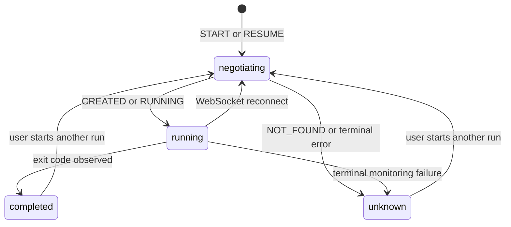

# 2026-07-15: Cell Execution Monitoring Semantics

## Status

This design is implemented by coordinated draft changes to the Runme runner and
Runme Web. It replaces the earlier client-only proposal that disabled
cross-session resume.

The first version distinguishes starting a run from resuming one. Retaining and
replaying a completed run's terminal result remains a future protocol extension.

## Decision

The first application message on a new execution WebSocket will declare whether
the client intends to start a new run or resume an existing run. The runner will
acknowledge that intent before the client sends execute requests or heartbeats.

- `START` creates a new execution and fails if its `runID` already exists.
- `RESUME` attaches to an active execution and fails if its `runID` is unknown.
- A legacy client that does not send the negotiation message keeps the existing
  create-or-attach behavior.

`runID` identifies an execution across connections. `streamID` identifies one
WebSocket connection to that execution and is regenerated on reconnect.

This removes the ambiguity that caused stale cells to appear to run forever. A
resume request can no longer create an empty multiplexer for an execution that
has already disappeared.

## Incident

Three cells in a local notebook showed as running after their commands had
finished. Each cell contained:

- `runme.dev/lastRunID`
- `runme.dev/pid`
- no `runme.dev/exitCode`

The operating-system processes no longer existed. Clearing the PIDs stopped the
running indicators, confirming that the UI was rendering persisted execution
metadata rather than live process state.

The state is reproducible without a live process:

1. Start a backend cell execution.
2. Deliver and persist its PID.
3. Disconnect the browser before the exit response arrives.
4. Let the process finish and let the runner remove its `runID`.
5. Recreate the browser notebook model and reconnect with the old `runID`.

Previously, the runner treated that unknown `runID` as a request to create a
new multiplexer. It answered heartbeats, but the multiplexer had no process and
would never produce an exit event. The cell therefore remained active.

## Existing Contract and Ambiguity

The web client persists three relevant facts:

- `lastRunID` identifies an execution attempt.
- `pid` records that the runner reported a process.
- `exitCode` records an observed terminal process result.

The runner previously used one operation for two meanings:

- a connection for an existing `runID` joined its multiplexer;
- a connection for an unknown `runID` created a multiplexer.

Completed runs are removed from the in-memory map, and responses are broadcast
live rather than replayed to later connections. After reconnecting, the client
therefore could not distinguish a quiet running process from a completed,
forgotten, or runner-lost process. Heartbeat success only proved transport
health; it did not prove process liveness.

No browser timeout can resolve this ambiguity because a valid process may be
quiet for an arbitrary amount of time.

## Protocol

The WebSocket request and response envelopes add an open-run exchange:

```proto
enum RunIntent {
  RUN_INTENT_UNSPECIFIED = 0;
  RUN_INTENT_START = 1;
  RUN_INTENT_RESUME = 2;
}

enum RunState {
  RUN_STATE_UNSPECIFIED = 0;
  RUN_STATE_CREATED = 1;
  RUN_STATE_RUNNING = 2;
}

message OpenRunRequest {
  RunIntent intent = 1;
}

message OpenRunResponse {
  RunState state = 1;
}
```

For a negotiating client, `OpenRunRequest` must be the first application
message. The runner validates authorization and identity before acting on the
intent. The result matrix is:

| Intent   | Runner state          | Result                                     |
| -------- | --------------------- | ------------------------------------------ |
| `START`  | `runID` is unknown    | Create it; reply `CREATED`                 |
| `START`  | `runID` exists        | Return `ALREADY_EXISTS`                    |
| `RESUME` | active `runID` exists | Attach to it; reply `RUNNING`              |
| `RESUME` | `runID` is unknown    | Return `NOT_FOUND`; do not create anything |

After a successful response, reconnects for that `Streams` instance use
`RESUME`. A second negotiation message on the same WebSocket is rejected.

The client waits for `OpenRunResponse` before releasing queued execute requests
or starting heartbeat traffic. This guarantees that the first operation has an
unambiguous meaning.

### Legacy Clients

Backward compatibility is server-side. If the first request is not
`OpenRunRequest`, the runner processes it with the old create-or-attach
semantics. Clients that know nothing about negotiation therefore continue to
work against the new runner without changes.

The inverse is not guaranteed: an old runner does not understand the new first
message. Deployment must therefore be runner-first.

| Client     | Runner | Behavior                                 |
| ---------- | ------ | ---------------------------------------- |
| Legacy     | New    | Existing create-or-attach behavior       |
| Negotiated | New    | Explicit `START`/`RESUME` behavior       |
| Negotiated | Legacy | Unsupported; deploy the new runner first |

Putting intent in the WebSocket query string was rejected because a legacy
runner could ignore an unknown query argument and silently retain the ambiguous
behavior. An application-level request produces an explicit response or an
explicit protocol failure.

## Web Client Behavior

The web client persists `runme.dev/executionState` with these values:

| State       | Meaning                                                         |
| ----------- | --------------------------------------------------------------- |
| `running`   | The runner acknowledged the run and no terminal result arrived. |
| `completed` | The client observed an exit code.                               |
| `unknown`   | Monitoring ended without an authoritative terminal result.      |

When a notebook model is recreated with a PID, a `lastRunID`, and no exit code,
it creates a stream using `RESUME` instead of assuming that the PID proves
liveness or immediately discarding the run:

- `RUNNING`: retain the PID and continue monitoring the same execution;
- `NOT_FOUND`: clear the PID, set `executionState=unknown`, preserve prior
  output, and explain that the result is unknown;
- terminal transport/protocol failure: use the same `unknown` transition after
  reconnect policy is exhausted.

`unknown` is terminal for the browser operation waiting on the run, but it is
not a process exit status. The client does not synthesize exit code `0` or `1`.



### Ten-hour Execution and Browser Refresh

Suppose a cell starts a ten-hour command and the browser refreshes after five
hours. The notebook reloads the persisted `runID` and opens a WebSocket with a
new `streamID`. Its first message is `RESUME` for the original `runID`.

If the runner still has that active execution, it replies `RUNNING`, attaches
the new stream to the existing multiplexer, and the browser resumes monitoring
the same process. It does not start the command again.

If the execution finished while the browser was absent, this version of the
runner has already discarded it and returns `NOT_FOUND`. The browser records
`unknown` rather than displaying a false running state. Recovering the actual
exit code in that case requires terminal-state retention.

## Future: Terminal-State Retention

This first protocol fix authoritatively answers whether a run is active. It does
not yet preserve completed results. A future version should retain a bounded
execution snapshot containing at least `runID`, terminal state, PID, and exit
code for longer than the expected reconnect window.

With that extension, `RESUME` could return `COMPLETED` and replay the real exit
code when the process ended during disconnection. Output replay would be useful
but is not required to fix liveness. Retention limits, runner restarts, and
snapshot persistence need a separate design decision.

## Rejected Alternatives

### Check the PID from the browser

PIDs are runner-local. The browser cannot test them portably, and PID reuse can
produce false positives.

### Mark interrupted executions successful or failed

A missing exit event supports neither conclusion. Synthesizing exit code `0` or
`1` would corrupt execution history.

### Use a quiet-period timeout

Long-running commands can produce no output for an arbitrary period. Silence is
not a terminal protocol event.

### Keep reconnecting with implicit semantics

The old runner creates an empty multiplexer for an unknown `runID`, so a
successful heartbeat does not confirm that the original process exists.

## Rollout

1. Deploy the backward-compatible runner implementation.
2. Verify that legacy clients continue to execute and reconnect.
3. Deploy the negotiating web client.
4. Consider terminal-state retention as a follow-up protocol change.

The web implementation currently serializes the small negotiation envelope
directly because the published Buf package does not yet contain the new schema.
It should switch to the generated message types after the runner proto is
published.

## Tests

Runner coverage verifies:

- negotiated `START` creates a run and returns `CREATED`;
- duplicate `START` returns `ALREADY_EXISTS`;
- negotiated `RESUME` attaches to the active run and returns `RUNNING`;
- `RESUME` for an unknown run returns `NOT_FOUND` without creating a run;
- legacy first messages retain create-or-attach behavior;
- existing round-trip and inactivity behavior remains intact.

Web coverage verifies:

- a `START` negotiation is the first message;
- execute requests remain queued until `CREATED` is received;
- persisted PID-without-exit metadata negotiates `RESUME` with the saved
  `runID`;
- stream errors become `unknown`, clear the PID, and preserve an explanatory
  stderr output;
- `CellData.run()` resolves when monitoring becomes `unknown`.
