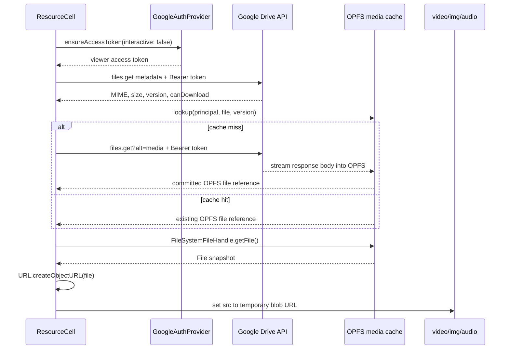

# Drive-Backed Linked Resources

Author: jlewi and Codex

Date: 2026-08-17

Status: Draft

## TL;DR

Runme will add a first-class linked-resource cell for video, audio, images,
documents, and ordinary links. The notebook will store a stable resource
reference and presentation hints, not the resource bytes or an access token.

Google Drive will be the default storage provider for uploaded media. Runme will
upload the original file to an asset folder next to the Drive-backed notebook
and store the resulting Drive file URL in the resource cell. Existing private
Drive files can be linked without copying them.

Private media cannot be rendered by assigning a Drive API URL directly to
`<video>` or `` because those elements cannot add an OAuth `Authorization`
header. Runme will use the current viewer's Google credential to download the
file into the origin private file system (OPFS). It will obtain a `File` from the
OPFS handle, create a temporary `blob:` URL, and assign that URL to the HTML
media element. The viewer's Drive identity remains the permission boundary:
sharing a notebook does not grant access to its media.

No Google access token, signed URL, object URL, OPFS path, or file bytes will be
persisted in notebook content. OPFS is a local cache, not the source of truth.
Runme will validate the cached version against Drive before using it and will
stream downloads into OPFS without first buffering the complete file in
JavaScript memory.

## Motivation

Runme can embed small images as base64 data inside HTML cells. That approach is
not suitable for video or large attachments:

- base64 increases the payload by roughly one third,
- notebook saves rewrite the entire embedded payload,
- large notebook JSON files are slow to load and synchronize,
- video needs a seekable local representation, and
- duplicating a file in every notebook prevents reuse and independent access
  control.

Raw Drive links do not solve private playback. A Drive file may be visible to
the signed-in user without being public. Browsers do not attach Runme's Google
OAuth token when an ``, `<video>`, `<audio>`, or `<iframe>` loads a Drive
URL.

Runme needs a resource model that separates three concerns:

1. The notebook stores a durable reference.
2. Google Drive stores and authorizes the bytes.
3. The current viewer supplies a short-lived credential when rendering.

## Goals

- Upload video, audio, images, PDFs, and other files to Google Drive from a
  notebook.
- Link an existing Drive file without making it public.
- Render supported private media with the current viewer's Drive access.
- Cache downloaded media in OPFS and render it through temporary object URLs.
- Preserve video seeking after the authenticated download completes.
- Render unsupported files and ordinary URLs as safe link cards.
- Keep credentials and large binary payloads out of notebook JSON.
- Use the same domain APIs from the UI, App Console, and WebMCP.
- Keep existing inline image embedding available for small, self-contained
  images.

## Non-Goals

- Grant Drive access when a notebook is shared.
- Copy the notebook's permissions onto every linked file.
- Proxy media through a Runme-operated service with elevated credentials.
- Persist Google access tokens in notebooks, OPFS, IndexedDB, or media URLs.
- Treat an OPFS copy as authorization to view a file after Drive access is
  revoked.
- Start video playback before the first authenticated download completes.
- Embed arbitrary web pages or Drive-hosted HTML as active same-origin content.
- Transcode video, generate thumbnails, or convert WebM to GIF.
- Replace Google Drive's sharing, revision, or retention controls.

## Current State

### Inline images

`embedImageInNotebook` accepts `image/*` values up to 10 MiB and stores a base64
data URL in a non-runnable HTML cell. This is useful for screenshots and small
animated GIF or WebP files. It intentionally does not accept `video/*`,
`audio/*`, or general attachments.

The new Drive-backed path will coexist with inline embedding:

- **Embed image** keeps the notebook self-contained.
- **Attach from Drive** keeps the original bytes in Drive.
- Video and audio always use the Drive-backed path.
- The UI should recommend Drive for large images.

### HTML and Markdown cells

HTML cells can render `<video>`, but the authored preview is a sandboxed
`iframe srcDoc`. It has no authenticated Drive client and cannot attach bearer
headers to media-element requests.

Markdown supports normal images and links but disables raw HTML. A public GIF
URL can render through Markdown; a private Drive image cannot.

### Drive storage and authentication

`DriveNotebookStore` already receives an `ensureAccessToken` callback and uses
the resulting bearer token for Drive REST requests. It can create, load, and
save arbitrary text content. Its generic content APIs currently accept and
return strings, so they are not suitable for binary media.

`GoogleAuthProvider.ensureAccessToken()` already handles cached OAuth tokens,
refresh tokens, interactive authorization, and the local test-only service
account flow. Resource loading should reuse this boundary rather than adding a
second credential store.

### OPFS

Runme already uses `navigator.storage.getDirectory()` for Jupyter shadows,
revision documents, and conflict snapshots. The existing storage code follows
the right split for media: IndexedDB holds small metadata and OPFS holds large
file payloads.

OPFS exposes handles, not a browser-navigable URL scheme. An OPFS path cannot be
assigned directly to `iframe.src`, `video.src`, or `img.src`.

## Decision

We will add a non-runnable linked-resource cell backed by a versioned JSON
reference. We will add binary upload and authenticated byte-loading operations
to the Drive storage layer. Authenticated downloads will stream into an OPFS
cache. The renderer will convert an OPFS `File` snapshot to a temporary `blob:`
URL.

We will not use authored HTML as the canonical representation. HTML cannot
safely own token refresh, OPFS cache validation, error UI, or object-URL cleanup.
A React `ResourceCell` in the main application can coordinate those behaviors
with the existing auth and storage providers.

## User Experience

### Upload a local file

1. The user clicks **Attach** or drops a file onto the notebook.
2. Runme identifies the target notebook before starting the upload.
3. For a Drive-backed notebook, Runme resolves or creates its sibling asset
   folder. For a local notebook, Runme asks the user to choose a Drive folder.
4. Runme uploads the file with its original name and MIME type.
5. Runme appends a linked-resource cell after the upload succeeds.
6. The new cell renders the file or shows a link card based on its MIME type.

The upload must complete before the notebook reference is saved. A failed
upload leaves the notebook unchanged.

### Attach an existing Drive file

1. The user chooses **Attach from Drive**.
2. The Drive picker allows files and shared-drive items rather than folders.
3. Runme reads the selected file's metadata with the current user's token.
4. Runme inserts a resource cell that references the existing Drive file.

Runme does not copy or change the selected file's permissions.

### Open a notebook containing private media

The notebook renders immediately without prompting for Google OAuth. Each
Drive resource first attempts non-interactive authorization.

- If a usable credential exists, Runme loads the metadata and media.
- If authorization is missing, the cell shows **Sign in to load**.
- If the viewer lacks file permission, the cell shows **Request access** and
  **Open in Drive**.
- If download is restricted, the cell remains a metadata-only link card.

Opening a notebook must not trigger an OAuth popup. Only a user click may call
`ensureAccessToken({ interactive: true })`.

### Presentation by content type

`presentation.mode: "auto"` maps authoritative Drive MIME metadata as follows:

| MIME family                                                     | Rendering                                                                        |
| --------------------------------------------------------------- | -------------------------------------------------------------------------------- |
| Safe raster images, GIF, and WebP                               | Responsive ``                                                               |
| Supported `video/*`                                             | `<video controls playsInline preload="metadata">`                                |
| Supported `audio/*`                                             | `<audio controls preload="metadata">`                                            |
| PDF                                                             | Sandboxed document preview after a separate security review; link card initially |
| Google Workspace native files                                   | Drive link card                                                                  |
| SVG, HTML, JavaScript, executables, archives, and unknown types | Link/download card                                                               |
| Ordinary HTTPS URL                                              | Link card unless the author explicitly selects a safe media mode                 |

Autoplay is off. A future screen-recording preset may enable `loop` and `muted`,
but loading a notebook must not start audio or unprompted playback.

## Notebook Representation

Resource cells will reuse the existing protobuf shape:

```ts
type LinkedResourceV1 = {
  version: 1
  source: {
    provider: 'google-drive' | 'https'
    uri: string
  }
  presentation: {
    mode: 'auto' | 'image' | 'video' | 'audio' | 'document' | 'link'
    title?: string
    altText?: string
    loop?: boolean
    muted?: boolean
  }
  hints?: {
    name?: string
    mimeType?: string
    sizeBytes?: number
  }
}
```

The notebook cell is:

```ts
{
  kind: CellKind.CODE,
  languageId: 'runme-resource',
  value: JSON.stringify(reference),
  metadata: {
    'runme.dev/linkedResource': 'true',
    'runme.dev/linkedResourceVersion': '1'
  }
}
```

`languageId: "runme-resource"` selects a dedicated renderer and makes the
non-execution rule explicit. The notebook execution paths must skip this
language in the same way they skip HTML content cells.

The `source.uri` is the durable identifier. A Drive source uses the canonical
form:

```text
https://drive.google.com/file/d/<file-id>/view
```

We will not store `local://` URIs because they are browser-specific. We will not
store `blob:` URLs because they expire. We will not store download URLs that
contain tokens or signatures.

`hints` improve initial display but are not trusted. The renderer refreshes
Drive metadata before deciding how to display a resource. The MIME type returned
by Drive is authoritative.

### Markdown sidecar

The primary notebook JSON preserves the complete structured reference. The
Markdown sidecar will degrade each resource to a portable link:

```markdown
[Demo recording](https://drive.google.com/file/d/FILE_ID/view)
```

The first version will not reconstruct a rich resource cell when importing that
sidecar. The URI and title survive, but presentation hints do not. A later
round-trip extension can add a hidden, versioned directive after the standard
link.

## Drive Asset Storage

### Asset folder

For a Drive-backed notebook, Runme will create or reuse one asset folder under
the notebook's parent folder. Its display name is `<notebook-name>.assets`. Its
stable identity comes from Drive `appProperties`, not the display name:

```json
{
  "runmeAssetFolder": "true",
  "runmeNotebookFileId": "<notebook-file-id>"
}
```

Renaming the notebook does not rename the folder in the first version. Moving
the notebook does not automatically move existing assets because every saved
resource reference remains valid by file ID.

If Runme cannot create a child folder, it asks the user to choose another Drive
folder. For local notebooks, choosing a Drive folder is always required on the
first upload. The selected folder is browser preference state, not part of the
resource reference.

### Permission behavior

New assets inherit permissions from their Drive folder. This makes a shared
notebook folder the recommended sharing boundary.

Runme will not copy notebook-file permissions to assets. Automatic permission
copying can disclose media to principals who should not receive it and behaves
poorly when permissions are inherited. If a notebook is shared as an individual
file, recipients may need separate access to its asset folder.

The UI will explain this boundary when an author inserts the first Drive asset:

> People need access to both this notebook and its Drive assets folder.

### Upload protocol

Drive uploads will use resumable upload for all binary files. Resumable upload
adds one setup request for small files and avoids restarting large video uploads
after a network interruption.

The initiation request includes the file name, MIME type, parent folder, and
app properties:

```json
{
  "name": "demo.webm",
  "mimeType": "video/webm",
  "parents": ["<asset-folder-id>"],
  "appProperties": {
    "runmeAsset": "true",
    "runmeNotebookFileId": "<notebook-file-id>",
    "runmeUploadOperationId": "<uuid>"
  }
}
```

`runmeUploadOperationId` makes retries idempotent. Before retrying a failed
create, Runme searches the target folder for that operation ID. Upload chunks
will be multiples of 256 KiB, with an initial target size of 8 MiB.

The binary API will accept `Blob`, `ArrayBuffer`, and `Uint8Array` without
converting them to strings:

```ts
type BinaryBody = Blob | ArrayBuffer | Uint8Array

type DriveResourceMetadata = {
  uri: string
  name: string
  mimeType: string
  sizeBytes?: number
  modifiedTime?: string
  md5Checksum?: string
  headRevisionId?: string
  canDownload: boolean
}

interface DriveResourceStore {
  getPrincipal(): Promise<{ permissionId: string }>

  upload(
    parentUri: string,
    name: string,
    body: BinaryBody,
    options: {
      mimeType: string
      operationId: string
      appProperties?: Record<string, string>
      onProgress?: (uploadedBytes: number, totalBytes: number) => void
      signal?: AbortSignal
    }
  ): Promise<DriveResourceMetadata>

  getMetadata(uri: string): Promise<DriveResourceMetadata>

  fetch(uri: string, options?: { signal?: AbortSignal }): Promise<Response>
}
```

`getPrincipal()` calls Drive `about.get(fields=user(permissionId))` and derives
the cache namespace from a SHA-256 hash of the opaque permission ID. It must not
use the access token, display name, or optional email address as an identity.

`DriveNotebookStore.createContent`, `loadContent`, and `saveContent` remain
text-oriented. The binary API is separate so accidental text decoding cannot
corrupt media.

### Deletion

Deleting a resource cell will not delete its Drive file. A file may be linked
from multiple notebooks or used outside Runme.

Files uploaded by Runme may expose a separate **Delete from Drive** action. It
requires confirmation and checks `runmeAsset: "true"` before deletion. Orphan
cleanup is not automatic in the first version.

## Authenticated Rendering

### Why direct Drive URLs do not work

Private blob content is downloaded with Drive `files.get(fileId, alt=media)` and
an OAuth bearer token. HTML media elements do not provide an API for setting an
`Authorization` header. Putting the token in a query string would expose it in
the DOM, browser history, diagnostics, and potentially referrer headers.

An authenticated `fetch()` can read the bytes. Runme should stream that response
to OPFS rather than call `response.blob()` or `response.arrayBuffer()`, both of
which materialize the whole file in JavaScript-managed memory.

### OPFS cache layout

OPFS stores one complete local copy per Drive principal, file, and version:

```text
runme/
  linked-resources/
    google-drive/
      <principal-key>/
        <file-id>/
          <version-key>/
            content
```

`principal-key` is a non-secret stable hash of the authenticated Drive
principal identifier. It prevents one Google identity from reusing a cache
entry authorized for another identity in the same browser profile.

`version-key` uses `md5Checksum` when Drive provides it, then
`headRevisionId`, then `modifiedTime` plus `size`. Path segments are encoded and
validated before OPFS access.

IndexedDB stores a small cache index:

```ts
type LinkedResourceCacheRecord = {
  key: string
  provider: 'google-drive'
  principalKey: string
  sourceUri: string
  versionKey: string
  opfsPath: string
  mimeType: string
  sizeBytes: number
  completedAt: string
  lastAccessedAt: string
}
```

The IndexedDB record is the commit marker. An OPFS file without a matching
record is incomplete or orphaned and must not be rendered.

### Download path



The download implementation will:

1. Obtain the current viewer's token with
   `ensureAccessToken({ interactive: false })`.
2. Read Drive metadata and verify `capabilities.canDownload`.
3. Resolve the authenticated principal and version key.
4. Check available storage with `navigator.storage.estimate()`.
5. Evict unused least-recently-used entries when space is insufficient.
6. Create or truncate the target OPFS file.
7. Stream `Response.body` into `FileSystemFileHandle.createWritable()`.
8. Close the writable and verify the resulting `File.size`.
9. Commit the IndexedDB cache record only after the complete write succeeds.

The write path must not expose a partial file. A cancelled or failed download
deletes its uncommitted file on a best-effort basis. Startup garbage collection
removes OPFS entries that have no committed cache record.

Downloads and eviction use a Web Lock keyed by principal, file ID, and version.
A contender rechecks the cache after acquiring the lock. If Web Locks are
unavailable, each download uses a unique temporary path and the IndexedDB commit
transaction selects one winner; losing temporary files are garbage-collected.

The first playback waits for the complete Drive download. The cell shows byte
progress when `Content-Length` is available. Once cached, local playback and
seeking do not require another media download.

### Rendering an OPFS file

OPFS does not define an `opfs:` URL scheme. Storing an HTML wrapper in OPFS does
not make that wrapper navigable, so an iframe cannot open an OPFS path directly.

The supported bridge is:

```ts
const root = await navigator.storage.getDirectory()
const handle = await resolveFileHandle(root, cacheRecord.opfsPath)
const file = await handle.getFile()
const typedBlob = new Blob([file], { type: cacheRecord.mimeType })
const objectUrl = URL.createObjectURL(typedBlob)
```

`file` is a `File` snapshot of the OPFS entry. Wrapping it in a typed `Blob`
restores the authoritative Drive MIME type without reading the bytes into an
`ArrayBuffer`. The object URL can be assigned to HTML elements:

```tsx
<video src={objectUrl} controls playsInline preload="metadata" />
<audio src={objectUrl} controls preload="metadata" />

<iframe src={objectUrl} sandbox="" title={title} />
```

Runme should render images, video, and audio directly in `ResourceCell`. An
iframe adds no value for those types. A generated HTML `srcDoc` could contain a
runtime object URL, but that URL still has to be created by the host and injected
on every render. Persisting the wrapper HTML would not preserve the object URL.

An iframe is useful only for browser-supported document previews such as PDF.
Active formats such as HTML and SVG must not be loaded as iframe documents under
the Runme origin. They remain link cards until a separate sandbox and content
security policy is reviewed.

Each component revokes its object URL when it unmounts, switches versions, or
releases the file. Object URLs are runtime capabilities and never enter notebook
JSON, IndexedDB cache metadata, or logs.

The production content security policy must allow `blob:` for `img-src`,
`media-src`, and the explicitly reviewed `frame-src` cases.

### Authorization and cache reuse

An OPFS copy is not evidence that the current viewer still has Drive access.
Before using a cached file in a new page session, Runme performs a non-interactive
metadata request with the current viewer's credential. This check both validates
permission and detects a newer version.

- `401` triggers one non-interactive refresh, then **Sign in to load**.
- `403` becomes **Request access** or **Download restricted**.
- `404` becomes **File not found**.
- Offline use shows an unavailable state in the first version, even if bytes are
  cached. Offline playback needs an explicit product and privacy decision.

Sign-out closes active media, revokes object URLs, and makes all principal-scoped
cache entries ineligible for use. Runme may purge those entries immediately or
through bounded garbage collection. Switching Google accounts never reuses the
previous account's cache namespace.

### Quota, persistence, and eviction

OPFS is origin/profile-local and subject to browser quota and eviction. Runme
will call the existing `ensurePersistentStorage()` helper after the user first
attaches or downloads media. The browser can decline persistence.

The cache manager will:

- use `navigator.storage.estimate()` before large downloads,
- keep mounted resource cells pinned during eviction,
- evict unpinned entries by `lastAccessedAt`,
- expose **Clear downloaded media** with the estimated bytes freed,
- tolerate OPFS data disappearing independently of IndexedDB, and
- redownload after a missing-file or size mismatch check.

The initial cache budget should be a fraction of the browser-reported quota,
not a fixed global size. The exact fraction remains an implementation setting
until browser testing establishes safe defaults.

### Memory fallback

If OPFS is unavailable, Runme may fetch files no larger than
`MAX_IN_MEMORY_MEDIA_BYTES`, initially 64 MiB, into a `Blob` and create a
temporary object URL. Larger files remain Drive link cards. The fallback is not
persisted and uses the same authorization and MIME checks.

## Link Cards and Safe Rendering

Drive metadata and the stored presentation mode determine the renderer. The
author cannot force an active renderer for an unsafe authoritative MIME type.
For example, a file reported as `text/html` remains a link card even if the
reference requests `mode: "video"`.

Link cards show:

- title and file name,
- provider,
- MIME type and size when available,
- access/loading/error state,
- **Open in Drive** for Drive files, and
- **Download** only when Drive reports `canDownload`.

Ordinary HTTPS links remain normal links by default. Runme will not fetch an
arbitrary page to generate a preview because that leaks viewer network activity
and adds CORS, cookie, tracking, and content-safety concerns.

## Domain and Automation APIs

The shared domain operation will resolve the target notebook once, create or
validate the Drive resource, and then insert the cell:

```ts
type AttachResourceSource =
  | { kind: 'file'; value: File | Blob; name?: string }
  | { kind: 'drive'; uri: string }
  | { kind: 'url'; uri: string }

type AttachResourceOptions = {
  target: { uri: string }
  folderUri?: string
  mode?: LinkedResourceV1['presentation']['mode']
  title?: string
  altText?: string
  expectedRevision?: string
  signal?: AbortSignal
}

async function attachResourceToNotebook(
  notebook: NotebookDataLike,
  source: AttachResourceSource,
  options: AttachResourceOptions
): Promise<{ uri: string; cell: Cell; resource: LinkedResourceV1 }>
```

App Console and WebMCP will expose the same operation:

```js
await notebooks.attach(
  { kind: 'drive', uri: 'https://drive.google.com/file/d/FILE_ID/view' },
  { target: { uri: notebookUri }, mode: 'video', title: 'Demo' }
)
```

Browser `File` and `Blob` values are accepted from App Console. External WebMCP
callers cannot send a browser `File`; they can attach an existing Drive URI or a
URL. A future upload tool may accept a host-provided file handle without putting
binary content into WebMCP JSON.

`notebooks.embed(...)` remains the inline-image API. `notebooks.attach(...)`
means the bytes live outside the notebook.

## Error Model

Drive and media errors need stable categories so UI, tests, and automation do
not parse message strings:

```ts
type LinkedResourceErrorCode =
  | 'AUTH_REQUIRED'
  | 'ACCESS_DENIED'
  | 'DOWNLOAD_RESTRICTED'
  | 'NOT_FOUND'
  | 'UNSUPPORTED_MEDIA_TYPE'
  | 'OPFS_UNAVAILABLE'
  | 'STORAGE_QUOTA_EXCEEDED'
  | 'CACHE_CORRUPT'
  | 'MEDIA_TOO_LARGE_FOR_FALLBACK'
  | 'DOWNLOAD_INTERRUPTED'
  | 'UPLOAD_INTERRUPTED'
  | 'RESOURCE_CHANGED'
  | 'PROVIDER_UNAVAILABLE'
```

Cells retain their reference when loading fails. An unavailable attachment must
not prevent the rest of the notebook from opening or executing.

## Security and Privacy

- The notebook stores no access token, refresh token, signed URL, or cookie.
- Drive downloads obtain a token from `GoogleAuthProvider` and do not persist it.
- Tokens are sent only to the configured Drive API origin.
- OPFS paths and object URLs are local implementation details and never enter
  notebook content.
- Cached files are namespaced by the authenticated Drive principal.
- A new page session validates Drive access before opening cached bytes.
- Sign-out and account switching make the prior principal's cache ineligible.
- Active formats such as HTML and JavaScript never render inline.
- MIME hints from notebook content never override Drive metadata.
- The app does not set `acknowledgeAbuse=true` automatically.
- Logs must not contain bearer tokens, response bodies, or object URLs.
- Access is evaluated as the current viewer, not the notebook author.
- A configured service account behaves as that service account; it does not
  inherit the human viewer's Drive access.

The design preserves Drive's authorization boundary. It does not make a private
file public and does not create a Runme-specific sharing bypass. OPFS is private
to the browser origin, but it is not application-level encrypted storage. The
browser profile and all trusted Runme code for that origin can access the cached
bytes.

## Offline and Sync Semantics

Resource references are ordinary notebook content and use existing notebook
sync and conflict handling. The media bytes remain separate Drive objects.

OPFS holds a persistent best-effort cache, but the first version does not expose
offline playback. An offline notebook shows the saved title and MIME hints with
an offline status. Allowing offline playback would make possession of the local
cache an authorization decision and requires a separate product, sign-out, and
at-rest privacy design.

Upload and notebook insertion are a two-resource transaction:

1. Upload media to Drive.
2. Append the resource cell with the expected notebook revision.

If step 2 conflicts or fails, Runme reports the uploaded Drive file and offers
**Retry insertion**. It does not silently delete the uploaded file. The upload
operation ID lets a retry reuse the same file.

## Implementation Plan

### Phase 1: model, cards, and authenticated metadata

- Add `LinkedResourceV1` parsing and validation.
- Add `isResourceLanguageId` and exclude resource cells from execution.
- Add `ResourceCell` with link-card and error states.
- Add authenticated binary metadata methods to the Drive store.
- Add Markdown sidecar link serialization and notebook diff summaries.
- Add `notebooks.attach` for existing Drive files and HTTPS links.

### Phase 2: upload and asset folders

- Add idempotent asset-folder resolution.
- Add resumable binary upload with cancellation and progress.
- Add file-picker and drag-and-drop attachment flows.
- Extend the Drive picker to select existing files.
- Add upload recovery after notebook revision conflicts.

### Phase 3: private media playback

- Add the principal- and version-scoped OPFS media cache.
- Stream authenticated Drive responses into OPFS with progress and cancellation.
- Add IndexedDB commit metadata, quota checks, and LRU cleanup.
- Render safe image, video, and audio MIME types.
- Create and revoke object URLs from OPFS `File` snapshots.
- Add bounded in-memory fallback when OPFS is unavailable.
- Add auth retry and permission-specific UI.

### Phase 4: hardening

- Add browser integration tests against a private Drive fixture folder.
- Add metrics for upload failures, download latency, cache hits, eviction, and
  fallback use without logging resource identifiers.
- Evaluate PDF rendering, progressive playback, and offline authorization
  separately.

## Testing

Unit tests will cover:

- resource schema validation and version rejection,
- Drive URL normalization and malformed file IDs,
- renderer selection from authoritative MIME metadata,
- safe degradation to a link card,
- Markdown sidecar serialization,
- non-execution of `runme-resource` cells,
- asset-folder lookup and idempotent upload retries,
- resumable chunk boundaries, cancellation, and recovery,
- OPFS path validation and principal/version isolation,
- streaming writes and the IndexedDB commit marker,
- partial-download cleanup and cache-miss recovery,
- quota checks, pinning, and LRU eviction,
- object-URL creation and revocation,
- stable error-code mapping, and
- absence of tokens in serialized notebook state and generated URLs.

OPFS cache tests will cover:

- cache lookup isolation by Drive principal,
- version changes creating a new cache entry,
- an OPFS file without a commit record being ignored,
- a commit record with a missing or wrong-sized file being repaired,
- token expiry and one refresh attempt,
- `403`, `404`, and download-restriction mapping,
- persistence requests being best-effort,
- sign-out making cached entries ineligible, and
- no token or response-body logging.

Browser integration tests will use a private Drive folder shared only with the
test service account. The fixture set will include a small WebM file, animated
GIF, audio file, PDF, and unsupported HTML file. Tests will verify that:

- no public sharing permission is added,
- the authorized identity can render supported media,
- the Drive response is streamed into OPFS without a full ArrayBuffer copy,
- video uses an OPFS-backed object URL and can seek after download,
- an unauthorized identity sees an access error rather than the bytes,
- a second Google identity cannot reuse the first identity's cache entry,
- unsupported active content remains a link card, and
- deleting the cell leaves the Drive file intact.

The repository validation command remains:

```sh
runme run build test
```

## Alternatives

### Base64-encode all media in HTML cells

Rejected for video and large files. It bloats notebook JSON, prevents efficient
seeking, and couples media lifecycle to every notebook save. Existing inline
image embedding remains useful for small images.

### Put an OAuth token in the Drive URL

Rejected. URLs leak through the DOM, history, logs, diagnostics, and referrer
handling. Token-bearing URLs also become stale when the token expires.

### Use Drive `webContentLink` directly

Rejected as the private media transport. It is useful for an explicit browser
download, but it does not give Runme reliable bearer-authenticated media
downloads, cache validation, embedded-host behavior, or service-account support.

### Fetch directly into a `Blob` and use a `blob:` URL

Accepted only as a bounded fallback. It is simple and private, but
`response.blob()` materializes the file outside OPFS and makes large downloads
more likely to exhaust memory. The primary path streams the response into OPFS,
then creates an object URL from the resulting `File`.

### Generate an HTML file in OPFS and open it in an iframe

Rejected as the OPFS bridge. OPFS exposes file handles and has no navigable
`opfs:` URL. An iframe cannot resolve a relative path into the origin-private
file system. Runme must first call `getFile()` and create an object URL.

A generated wrapper can be passed to `iframe.srcDoc` after the host injects that
runtime object URL, but this adds a second document and lifecycle without
removing the host-side work. Direct `<video>`, `<audio>`, and `` elements
are simpler. `iframe.src = objectUrl` remains available for explicitly allowed
document types.

### Stream Drive through a service-worker URL

Deferred. A same-origin service worker could add the user's bearer token and
forward Drive range requests, allowing playback before the complete file is in
OPFS. It also adds a token-message protocol, service-worker lifecycle, range
correctness, and a second media transport. We should add it only if waiting for
the initial OPFS download is unacceptable in product testing.

### Proxy media through the Runme backend

Deferred. A backend proxy could add authorization and ranges, but it would make
Runme infrastructure handle user Drive tokens and private media bytes. The
browser already owns the user's Drive credential, so a client-side bridge keeps
the trust boundary smaller.

### Make Drive files public when attached

Rejected. Public sharing violates the requirement and surprises authors. Drive
ACLs remain authoritative.

### Render every Drive link automatically

Rejected. A normal link should remain predictable. Rich rendering requires an
explicit resource cell or attachment action.

### Add a protobuf resource cell kind

Deferred. `CellKind.CODE` plus `languageId: "runme-resource"` follows the HTML
cell precedent and avoids a schema migration. A dedicated protobuf kind can be
reconsidered if other clients adopt the resource model.

## Open Questions

- Should the first-use asset-folder notice be informational or require explicit
  confirmation?
- Should authors be able to choose between the per-notebook asset folder and
  the notebook's parent folder on every upload?
- Is 64 MiB the right in-memory fallback limit when OPFS is unavailable?
- What fraction of `navigator.storage.estimate().quota` should the media cache
  target before LRU eviction?
- Should sign-out delete a principal's cached bytes immediately or leave them
  for bounded garbage collection while making them ineligible?
- Should the Markdown sidecar add a hidden versioned directive for lossless
  re-import in the first release or a later one?
- Which exact image, video, and audio MIME types should pass the initial safe
  renderer allowlist?

## References

- [Google Drive: Download and export files](https://developers.google.com/workspace/drive/api/guides/manage-downloads)
  documents `files.get(..., alt=media)`, OAuth authorization, download
  restrictions, and partial downloads with the `Range` header.
- [Google Drive: Upload file data](https://developers.google.com/workspace/drive/api/guides/manage-uploads)
  documents resumable uploads and 256 KiB chunk alignment.
- [Google Drive: Return user information](https://developers.google.com/workspace/drive/api/guides/user-info)
  documents `about.get` and the opaque `user.permissionId` used to namespace
  cache entries by Drive principal.
- [WHATWG File System Standard](https://fs.spec.whatwg.org/) defines
  `navigator.storage.getDirectory()` and `FileSystemFileHandle.getFile()`.
- [W3C File API](https://w3c.github.io/FileAPI/) defines object URL creation,
  revocation, and lifetime.
- [Inline Image Embedding](./20260719_inline_image_embedding.md) describes the
  existing base64 image path.
- [HTML Cells](./20260513_html_cells.md) defines the authored HTML sandbox and
  non-execution policy.
- [Google Drive Service Account Auth](./20260613_drive_service_account_auth.md)
  defines the existing test-only service-account credential flow.
- [Excalidraw Drive Documents](./20260616_excalidraw_drive_documents.md)
  defines the current generic Drive content APIs.
- [Conflict Snapshot Storage in OPFS](./20260604_conflict_snapshots_opfs.md)
  defines the existing IndexedDB metadata plus OPFS payload pattern.
