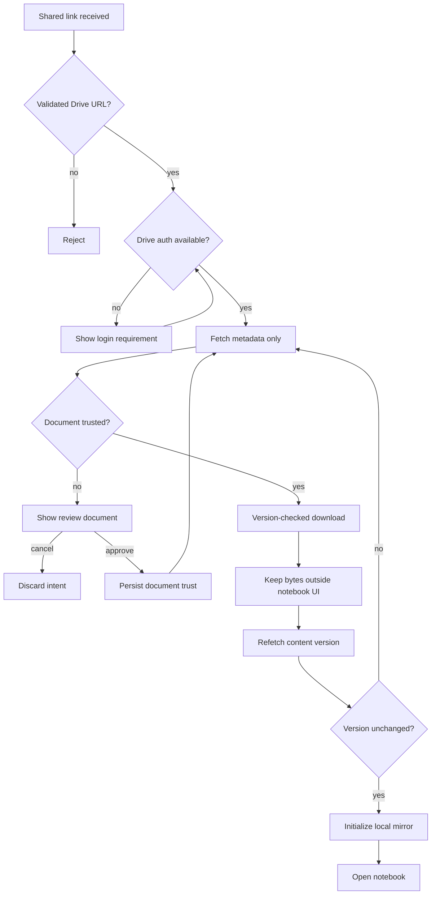

# 2026-08-22: Shared notebook link trust

## Status

P0 implemented. URL-driven notebook opens now pass through a metadata-only
trust decision and a version-checked import. Renderer and execution hardening
remain follow-up work.

## Decision

Runme will not download, parse, initialize a local mirror, or render a notebook
solely because a user navigated to a `?doc=<Google Drive URL>` link.

Runme will first fetch a bounded set of Google Drive metadata from Google's API
and evaluate local policy. The P0 policy automatically trusts files that Drive
reports as owned by the current account, files whose owner email domain exactly
matches the current non-consumer Workspace domain, previously approved
documents, and files in a locally allowlisted Shared Drive. All other files
stop at a review screen. The user must explicitly choose **Trust this document
and open** before Runme fetches notebook bytes.

Trust is bound to the effective Google principal, Drive file ID, and an
ownership/Shared Drive fingerprint. It survives ordinary revisions. Drive
`version`, `headRevisionId`, and `md5Checksum` are transaction-integrity
signals: Runme checks them before and after download so it never opens different
bytes from the metadata snapshot that passed policy.

Same-domain ownership is a pragmatic trust policy, not a malware verdict. It
reduces friction for internal sharing but accepts the risk of a malicious or
compromised account in the same organization. Known public consumer email
domains are never treated as organizations. A future administrator policy
should replace email suffix inference with verified Workspace organization
identity.

## Why this is P0

A shared Runme URL is an untrusted document delivery mechanism. Today the URL
path can progress from a Drive metadata request to a local mirror and an open
notebook without a trust decision:

1. `DriveLinkCoordinatorHost` consumes `?doc=`.
2. `driveLinkCoordinator.processIntent` calls `fetchDriveItemWithParents`.
3. The coordinator calls `LocalNotebooks.addFile` and then `openNotebook`.
4. `LocalNotebooks.load` synchronizes an uninitialized mirror from Drive.
5. React mounts the notebook and its stored rich content.

Opening is not passive:

- Markdown images use attacker-controlled `src` URLs and load automatically.
- Authored HTML cells mount an `iframe srcDoc` automatically. Their empty
  sandbox blocks script, but does not block all network subresources.
- Stored `text/html` outputs mount an `iframe` with `sandbox="allow-scripts"`.
  Script cannot read the parent origin because `allow-same-origin` is absent,
  but it can execute immediately, render deceptive UI, consume resources, and
  attempt outbound requests from its opaque origin.
- Stored image and SVG outputs are decoded automatically and can consume CPU or
  memory.
- A notebook can socially engineer a user into executing code against a local,
  Jupyter, or cloud runner. Execution can expose files, environment variables,
  cloud credentials, and any other capability held by that runner.

The current browser security boundaries reduce the impact of a malicious
notebook but do not make automatic opening safe. A future renderer regression
or sandbox bypass would also have a high-value target: Runme currently holds a
broad Google Drive OAuth token in origin storage.

## Security invariant

No attacker-controlled notebook byte or attacker-controlled remote asset may
reach a parser, renderer, media decoder, executable runtime, or browser network
sink before the user or trust policy accepts the document. The accepted Drive
metadata snapshot must remain unchanged throughout download and local mirror
initialization.

The metadata review path may process untrusted strings, but it must render them
as text and must not dereference URLs returned in metadata.

## Precedents

### Jupyter

Jupyter defines the core invariant directly: code must not execute merely
because a user opened a notebook they did not write. Its model sanitizes
untrusted HTML, never executes untrusted JavaScript, never trusts HTML or
JavaScript in Markdown, and trusts outputs produced by the current user.
Jupyter signs notebook contents with a per-user secret and checks that
signature when the notebook is reopened. A user can explicitly trust an
otherwise untrusted notebook.

JupyterLab blocks interactive outputs until the notebook is trusted, exposes
trust state with a shield, and always sanitizes Markdown. Its trust decision is
about active stored output, not permission to read file metadata.

Runme should adopt Jupyter's central question—“did the current user produce or
approve this exact content?”—but put the first decision before content download
because Runme already has enough provider metadata to present a useful review.

Sources:

- [Jupyter Server: Security in notebook documents](https://jupyter-server.readthedocs.io/en/latest/operators/security.html#security-in-notebook-documents)
- [JupyterLab: Notebook trust](https://jupyterlab.readthedocs.io/en/stable/user/notebook.html#trust)

### Google Colab

Colab's public documentation distinguishes reading a notebook from granting it
power. It warns users to trust notebook authors before execution. Mounting
Google Drive normally requires a manual grant because notebook code then gains
access to the user's Drive. Colab only reuses that grant after multiple checks;
the documented example says a notebook edited by another user does not qualify
for automatic remount. Colab also restricts automatic scheduled execution when
it cannot establish that the notebook was edited only by the user.

Runme should likewise separate three decisions:

1. inspect provider metadata;
2. display stored notebook content;
3. execute code or grant external capabilities.

Sources:

- [Colab FAQ: Drive mounting and edited notebooks](https://research.google.com/colaboratory/faq.html#drive-mount)
- [Colab local runtimes: Security considerations](https://research.google.com/colaboratory/local-runtimes.html#security-considerations)

## Threat model

### Protected assets

- Google Drive access and refresh tokens stored by Runme.
- Notebook data already mirrored in IndexedDB or OPFS.
- Local files, environment variables, and credentials exposed to a runner.
- Cloud credentials and APIs available through service-account or user
  impersonation.
- The user's identity, network location, and browser resources.
- User trust in the `web.runme.dev` origin.

### Attacker capabilities

The attacker can create or modify a Drive notebook, save arbitrary cells and
outputs, share it with the victim, and send a Runme URL containing the Drive
file ID. The attacker may be external, in the same Workspace organization, or
a collaborator on a user-owned file. The attacker may race a file update while
the victim reviews it.

The attacker cannot initially read the victim's Runme origin, Drive token, or
runner state. The design must preserve that boundary even if the document
contains HTML, JavaScript output, SVG, large media, malformed JSON, misleading
filenames, or nested Drive shortcuts.

### Primary abuse cases

| Abuse case | Current trigger | Potential impact | P0 control |
| --- | --- | --- | --- |
| Tracking beacon | Markdown image or HTML subresource mounts | IP/user-agent disclosure and link-open confirmation | Do not render before approval |
| Stored script | `text/html` output mounts with `allow-scripts` | Phishing UI, outbound requests, resource abuse, exploitation of renderer defects | Do not render before approval; later add output CSP |
| Credential phishing | Notebook or output imitates Runme/Google login | User enters credentials into attacker UI | Metadata interstitial; visible trust state; iframe UI hardening |
| Runner code execution | User runs an attacker cell | Local/cloud data theft or destruction | Separate first-execution capability confirmation |
| Parser/decoder denial of service | Oversized or pathological notebook/output | Browser crash or storage exhaustion | Size/cell/output budgets and worker parsing |
| Time-of-check/time-of-use race | Attacker changes file after review | Different bytes open than the user approved | Bind approval to Drive version and recheck after fetch |
| Trust confusion through Drive shortcut | Benign-looking shortcut targets another file | Wrong owner/location evidence | Resolve and review the ultimate target |
| Cross-account trust reuse | Browser changes Google principal | One account inherits another account's approval | Principal-scoped trust records |

### Out of scope for P0

- Proving that a known author is uncompromised.
- Malware scanning or semantic review of notebook code.
- Making arbitrary runner execution safe.
- A complete enterprise reputation service.
- Rendering an untrusted notebook in a reduced-function preview.

## Trust model

### Trust is document-scoped, principal-scoped, and local

A trust record has this shape:

```ts
type NotebookTrustRecord = {
  provider: 'google-drive'
  effectivePrincipal: string
  fileId: string
  basis: 'explicit_document' | 'owned_by_me' | 'same_domain' | 'trusted_drive'
  subjectFingerprint: string
  trustedAt: string
}
```

P0 uses the normalized effective Drive account email because every current auth
mode exposes it. Service-account and impersonated sessions use the effective
Drive principal, not merely the human who authorized the session. Replace this
with a stable verified principal ID when the auth layer exposes one consistently.

Store records in Runme's origin-local database. Do not write trust into the
notebook or Drive `appProperties`: a document author must not be able to assert
their own trust.

Explicit approval is document-scoped and survives revisions. It is invalidated
when the ownership/Shared Drive fingerprint changes. Version changes do not
re-prompt; they are guarded by the import transaction's pre/post checks.

### Automatic trust in P0

These cases bypass the review screen:

- A matching trust record exists for the effective principal, file ID, and
  current ownership/drive fingerprint.
- Drive reports `ownedByMe=true`.
- At least one owner email has the same exact non-consumer domain as the
  effective Drive principal.
- `driveId` appears in the local trusted-Shared-Drive policy.

`lastModifyingUser.me`, `isAppAuthorized`, prior viewing, editor permissions,
and Shared Drive membership without an allowlist do not establish trust.

### Same-domain tradeoff

P0 accepts same-domain ownership as an automatic signal to support the core
internal-sharing workflow. The comparison is normalized, exact, and disabled
for known public consumer providers such as Gmail, Outlook, Yahoo, iCloud, and
Proton.

This is weaker than verified organization membership. Drive owner email can be
absent; Shared Drive files have no individual owner; same-organization accounts
can be malicious or compromised; and collaborators can change a user-owned
file. The review UI and trust basis must not describe same-domain content as
safe. A later backend can verify both principals against Workspace identity and
apply an auditable administrator policy.

Source: [Google OpenID Connect claims](https://developers.google.com/identity/openid-connect/reference#id_token)

## Google Drive metadata preflight

### Request

After non-interactive Drive authentication succeeds, call `files.get` with
`supportsAllDrives=true` and an explicit field mask:

```text
id,name,mimeType,size,createdTime,modifiedTime,version,
md5Checksum,headRevisionId,driveId,parents,ownedByMe,shared,
isAppAuthorized,shortcutDetails(targetId,targetMimeType,targetResourceKey),
owners(displayName,emailAddress,me,permissionId),
sharingUser(displayName,emailAddress,me,permissionId),
lastModifyingUser(displayName,emailAddress,me,permissionId),
capabilities(canDownload),resourceKey
```

If the item is a shortcut, resolve `shortcutDetails.targetId` and repeat the
preflight for the target. Apply a small depth/cycle limit and make the target,
not the shortcut, the trust subject.

For `driveId`, fetch only the shared-drive name and membership/policy data
needed by the UI. For `parents`, fetch bounded parent names. Do not attempt an
unbounded hierarchy walk. “Location unavailable” is valid.

### Safe fields to display

| Signal | UI use | Trust weight | Caveat |
| --- | --- | --- | --- |
| `name` | Primary title | Context only | Untrusted text; can impersonate a known notebook |
| `mimeType`, `size` | Type/size warning | Validation | Reject unsupported type and oversize files |
| `owners[]` | Owner identity | Medium context | Absent for shared drives; email may be hidden |
| `sharingUser` | “Shared with you by” | Medium context | Sharer is not necessarily owner or author |
| `lastModifyingUser` | Latest editor warning | Medium context | Does not attest all persisted content |
| `ownedByMe` | “You own this file” | Positive context | Collaborators may still have edited it |
| `driveId` + drive name | Shared-drive provenance | Policy input | Shared drive is organization-owned; name is untrusted text |
| `parents` + parent names | Best-effort location | Context only | Parent access/path can be incomplete |
| `version` | Approval binding | Strong freshness | Changes for server-side metadata changes too |
| `headRevisionId`, `md5Checksum` | Content/version binding | Strong freshness | Only available for applicable binary content |
| `capabilities.canDownload` | Eligibility | Enforcement | Says nothing about safety |
| `isAppAuthorized` | Diagnostics | Weak context | App access is not authorship or safety |

Google documents that `owners` is absent for shared-drive items, user email can
be hidden, `version` increases for every server-side change, and shared-drive
ownership belongs to an organization.

Sources:

- [Drive File resource](https://developers.google.com/workspace/drive/api/reference/rest/v3/files)
- [Drive User resource](https://developers.google.com/workspace/drive/api/reference/rest/v3/User)
- [Drive files and folders: ownership](https://developers.google.com/workspace/drive/api/guides/about-files#ownership)
- [Drive shared drives overview](https://developers.google.com/workspace/drive/api/guides/about-shareddrives)

### Metadata-path restrictions

- Treat every returned string as plain text. React interpolation is acceptable;
  `innerHTML` is not.
- Do not load `thumbnailLink`, `iconLink`, `photoLink`, descriptions containing
  markup, or any URL supplied by the file.
- Compute the external Drive URL from the validated file ID and fixed
  `https://drive.google.com/file/d/<id>/view` template.
- Send credentials only to the configured Google API origin. The existing
  `resourceFetch` same-origin check is the model.
- Bound response size, parent lookups, retries, and total preflight time.
- Do not put filenames, owner emails, full Drive URLs, or file IDs in analytics.

## User experience

### Review screen

The existing `status://drive-link` document becomes a review document. It does
not mount a notebook component.

```text
Review shared notebook

Opening a notebook can load active content and code. Only continue if you
recognize the source and expect this file.

Name              quarterly-analysis.ipynb
Owner             Alice Example (alice@example.com)
Shared by         Bob Example (bob@partner.example)
Last modified by  Carol Example (carol@example.com)
Location          Finance Shared Drive / Forecasts
Modified          2026-08-21 15:42 PDT
Type / size        Jupyter notebook / 2.4 MiB

[Cancel] [Open in Google Drive] [Trust this document and open]
```

Rules:

- **Cancel** is the default focused action.
- The trust action states its persistent document scope. Avoid generic
  **Continue** or **Open**.
- External owner, unknown owner, shared-drive owner absence, unsupported MIME,
  unusually large size, and a different last editor receive explicit text.
- Do not use green “safe” styling. Provider identity is evidence, not a malware
  verdict.
- Authentication happens as a separate step. Logging in to Drive does not
  approve the notebook.
- Multiple queued links are reviewed separately.
- If metadata changes while the screen is open, refresh the screen and require
  a new click.

### Persistent trust state

P1 should show the trust basis in the notebook tab:

- **You trusted this document**: explicit document approval.
- **Owned by you**: Drive reports `ownedByMe`.
- **Organization owner**: same-domain policy accepted the file.
- **Trusted Shared Drive**: local or administrator policy accepted `driveId`.

Do not use **Trusted author** in P0. Runme has not authenticated authorship of
all notebook bytes or outputs.

### Execution is a separate capability decision

Trusting display does not imply permission to run code. The first execution of
a shared notebook should show the selected runner and the capabilities it can
reach. High-risk grants such as Drive mounting, service-account use, local
filesystem access, or a local runtime require their own confirmation. This
matches Colab's manual Drive-mount boundary.

This execution confirmation is P1 unless Runme currently auto-executes any
cell. Automatic execution from link navigation is forbidden in P0.

## State machine



The content must remain unreachable by notebook renderers until state `O`.

## Implemented P0

### New modules

```ts
type DriveVersionIdentity = {
  checksum?: string
  revisionId?: string
  version?: string
}

interface SharedNotebookPreflight {
  uri: string
  fileId: string
  name: string
  mimeType: string
  sizeBytes?: number
  modifiedTime?: string
  version?: string
  headRevisionId?: string
  md5Checksum?: string
  owners: DriveIdentity[]
  sharingUser?: DriveIdentity
  lastModifyingUser?: DriveIdentity
  ownedByMe?: boolean
  driveId?: string
  parents: NotebookStoreItem[]
  canDownload: boolean
}

declare function evaluateSharedNotebookTrust(input: {
  preflight: SharedNotebookPreflight
  effectivePrincipal: string | null
}): SharedNotebookTrustDecision
```

Implemented in:

- `app/src/lib/sharedNotebookTrust.ts`: policy and local trust records.
- `app/src/storage/drive.ts`: bounded metadata preflight.
- `app/src/storage/local.ts`: version-checked import and mirror initialization.
- `app/src/components/DriveLinkStatusTab.tsx`: inert review UI.

### Coordinator changes

Extend `DriveLinkIntentStatus` with `fetching_metadata` and `awaiting_review`.
Attach a serializable preflight snapshot to the intent, excluding access tokens.

Change `processIntent`:

1. authenticate non-interactively;
2. fetch metadata only;
3. reject folders from the notebook-review flow and keep folder mounting as a
   separate explicit action;
4. evaluate document trust for the current effective principal;
5. stop in `awaiting_review` unless policy trusts the document;
6. call the version-checked import method only after approval.

The coordinator must not call `addFile`, `updateFolder`, `openNotebook`,
`loadContent`, `DriveNotebookStore.load`, or `LocalNotebooks.load` while the
intent is untrusted.

### Version-checked import

Approval records document trust, then re-enters the metadata policy check. The
import operation owns the byte transition:

```ts
importTrustedDriveSnapshot(
  remoteUri: string,
  name: string,
  options: { mimeType?: string; expected: DriveVersionIdentity },
): Promise<string>
```

The operation:

1. creates only an uninitialized local metadata record;
2. refetches the current content version and compares it with preflight;
3. downloads bytes without exposing them to notebook UI state;
4. refetches Drive content-version metadata;
5. aborts if `version`, `headRevisionId`, or `md5Checksum` changed;
6. decodes and initializes the local mirror;
7. returns a local URI that is safe to pass to `openNotebook`.

At least one Drive version signal is required. If Drive does not provide a
content hash, use the pre/post `version` or `headRevisionId` check. Never
silently open bytes from a different metadata snapshot.

### Folder links

The existing coordinator recursively mirrors a shared folder. That can import
many unreviewed notebooks and assets. P0 must not recursively mount a folder
from `?doc=`. Show folder metadata and require **Mount folder**. Files discovered
inside the folder remain unopened; each first open goes through notebook
review. An admin-trusted shared-drive policy may relax this later.

## Defense in depth after P0

The review gate reduces exposure but does not replace renderer hardening.
Jupyter's model still sanitizes Markdown even for trusted notebooks.

### Markdown and remote assets

- Keep raw HTML disabled.
- Validate URL schemes.
- Add `referrerPolicy="no-referrer"` to external resources.
- Prefer an explicit **Load external images** action or a same-origin media
  proxy with size and MIME checks.
- Never interpolate notebook URLs into privileged fetches.

### Authored HTML cells

Keep `sandbox=""` and inject a restrictive CSP into `srcDoc`, initially:

```text
default-src 'none'; img-src data: blob:; media-src data: blob:;
style-src 'unsafe-inline'; font-src data:; form-action 'none'; base-uri 'none'
```

This preserves static HTML/SVG while blocking external subresources.

### Stored HTML outputs

Do not mount stored `text/html` output until the version is trusted. When
scripted output is enabled, use an isolated output origin plus a restrictive
CSP and a narrow, validated message protocol. `sandbox="allow-scripts"` without
`allow-same-origin` is a useful boundary, but it is not a network policy.

### Resource limits

Set limits for:

- raw notebook bytes;
- number and size of cells;
- aggregate decoded output bytes;
- SVG/image dimensions and decode time;
- HTML output frame count;
- linked-resource count and automatic fetches.

Parsing should happen off the main thread. Fail closed with a user-readable
error and an option to inspect the file in Drive.

## Observability and privacy

Record only coarse events:

- preflight started/succeeded/failed;
- review shown;
- cancelled/approved;
- automatically matched document policy;
- version changed during approval;
- import blocked by type/size/parser policy.

Do not log notebook names, Drive URLs, file IDs, owner/sharer emails, parent
names, or content hashes to analytics. Application logs should use a local
correlation ID. Security telemetry can use a keyed, rotating pseudonym only if
there is a documented retention and access policy.

## Testing

### Unit tests

- A URL-sourced file reaches `awaiting_review` without invoking `addFile`,
  `loadContent`, `openNotebook`, or any renderer.
- Cancel removes the intent and never downloads content.
- Approval is scoped to principal + file ID + ownership/drive fingerprint.
- Changing principal invalidates the match.
- Same-domain Workspace ownership opens automatically; known consumer email
  domains do not.
- A changed Drive content version aborts the import without initializing bytes.
- Missing owner/email and shared-drive owner absence fail closed without UI
  crashes.
- Shortcut metadata is resolved to the ultimate file.
- Filenames and identity strings containing markup render as text.
- Folder links do not recursively mirror files before explicit mount.

### Browser tests

- A malicious Markdown image server receives no request before approval.
- Script in persisted HTML output does not run before approval.
- An HTML cell cannot fetch an external image after output CSP hardening.
- A file changed between review and download never opens.
- Oversized/malformed notebooks do not block the main thread or exhaust local
  storage.
- Back/forward, focus, `pageshow`, and multi-tab events do not duplicate an
  approval or bypass review.
- A previously cached local mirror does not bypass the version gate.
- Direct manual open, rendered Markdown links, App Console helpers, and WebMCP
  all call the same trust policy when the source is remote.

### Security regression fixture

Add a generated notebook fixture containing:

- Markdown remote image and link schemes;
- authored HTML with script, form, iframe, external CSS, image, video, and
  audio;
- stored HTML output with script and network beacons;
- inline and external SVG;
- large base64 outputs;
- cells that request powerful runners.

The test server records every request. The pre-approval request count to
attacker-controlled origins must remain zero.

## Rollout

1. **P0:** ship metadata preflight, review UI, principal/document trust records,
   version-checked import, and regression tests. Enable by default with no
   legacy bypass.
3. **P1:** add persistent trust indicators, first-execution capability review,
   renderer CSP, external-asset gating, and resource budgets.
4. **P2:** add verified Workspace/admin policies for organization IDs and
   allowlisted shared drives. Keep auditability and user-visible policy source.

Monitor approval rate, cancellation rate, preflight failures, version races,
and blocked imports. Do not measure identity or filenames.

## Alternatives rejected

### Require review for every new revision

Rejected for P0. It creates repeated prompts during normal collaboration and
confuses document trust with transaction integrity. Runme persists document
trust and separately verifies that downloaded bytes match the policy-evaluated
metadata snapshot.

### Download first, but do not render

Rejected for P0. It unnecessarily exposes parsers, storage, and sync paths to
untrusted bytes and complicates proof that no renderer observes the content.

### Open read-only

Rejected as a security control. Read-only prevents notebook mutation; it does
not stop stored HTML, images, media, or output from rendering.

### Rely only on iframe sandboxing

Rejected. Sandboxing protects the parent origin but does not provide complete
network, resource, phishing, or runner-execution protection.

### Trust the Drive ACL

Rejected. Authorization answers whether the current principal may read the
file. It does not attest who authored the bytes or whether they are safe.

## Open questions

- What maximum notebook and decoded-output sizes preserve existing real-world
  notebooks?
- Should explicit approval survive browser data clearing or synchronize across
  devices? P0 says no.
- Which verified organization identifier can Runme obtain in every auth mode,
  including service accounts and impersonation?
- Should administrator policy replace email-domain inference with verified
  Workspace organization IDs? P0 says yes when that identity is available.
- Should folder mounting require per-file review or only review on first open?
  P0 chooses review on first open and no recursive content download.
- Which output features require scripts strongly enough to justify a dedicated
  output origin?

## Acceptance criteria

- Navigating to an unknown Drive notebook URL causes zero notebook-content and
  attacker-origin requests before an explicit trust decision.
- The review screen shows safely rendered provider metadata, including owner or
  shared-drive provenance when available.
- Same-domain ownership automatically trusts a notebook only for an exact,
  non-consumer domain match.
- Approval persists for the document but opens only bytes from the metadata
  snapshot that passed policy.
- A principal switch, ownership/drive fingerprint change, shortcut target
  change, or missing trust record returns to review.
- Every remote-open entry point uses the same policy gate.
- Tests demonstrate that Markdown, HTML, SVG, media, and stored outputs cannot
  become active before approval.
