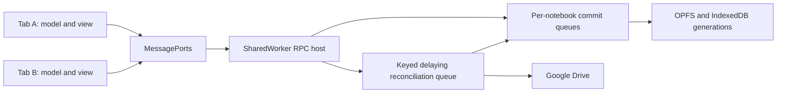

# Recover unfinished Drive sync from durable state

## Problem and objective

A failed save must recover when credentials or connectivity return, without
requiring another edit. The old scan excluded failed downloads when hashes
matched or were empty, and ran only on an auth transition. Missing `.runme`
checksums were repaired from the empty IndexedDB `doc` placeholder instead of
OPFS. Direct creation needed a replayable request before any Drive mutation.

The contract follows [level-based resync](20260312_resyncdrive.md) and
[Drive version tracking](20260409_track_drive_versions.md): durable content and
recovery state determine unfinished work. The queue only schedules it.

## Content and checksum domains

| Format | Local content/hash | Comparable acknowledged baseline |
| --- | --- | --- |
| `.json` | IndexedDB serialized model / `md5Checksum` | `lastRemoteChecksum` |
| `.ipynb` | Decoded model / `md5Checksum` | `ipynbPreservation.baselineNotebookChecksum` |
| `.runme` | OPFS operation log / cached `md5Checksum` | Acknowledged local log snapshot / `lastRemoteChecksum` |

Raw IPYNB fingerprints differ from decoded hashes. Canonical operation ordering
can make raw Drive `.runme` bytes differ from the acknowledged local snapshot;
raw upstream identity remains in `lastUpstreamVersion.checksum`. Do not collapse
these domains or weaken conflict/version checks.

For example, independent operations may appear locally as `[B, A]` and upstream
in canonical order `[A, B]`: the same operations have different byte hashes.
`lastRemoteChecksum` remembers the local snapshot acknowledged upstream;
`lastUpstreamVersion.checksum` identifies the actual upstream bytes/version.
Compare current local bytes with the acknowledged local snapshot for local edits.

The IndexedDB-backed scan compares fields in application code. Conflicts are
excluded. Pending creation qualifies before checksum comparison. A retained
`lastSyncError` qualifies regardless of checksum equality: matching or empty
hashes do not prove the latest download succeeded. A failed first download must
retry reading, never upload its empty placeholder.

## Lazy checksum computation during reconciliation

Local `.runme` saves invalidate `md5Checksum`; Drive reconciliation computes and
publishes it. An unset checksum is normal pending-sync state, not corruption or
an empty notebook. Scans and status views only inspect metadata and enqueue the
URI; they do not hash OPFS or publish a checksum. Preserve `lastRemoteChecksum`
as the acknowledged local baseline.

### Local commit

All tabs submit mutations to one SharedWorker. Its per-notebook commit queue:

1. Commits an IndexedDB transaction incrementing `contentGenerations[path].generation` and clearing
   `md5Checksum`. Await the commit; abort before OPFS if it fails.
2. Writes/appends OPFS and awaits durable close, then records necessary log identity.
3. Leaves the checksum unset, acknowledges the local save and enqueues reconciliation.

Every mutation path participates, including edits, execution records, annotations,
revisions, imports/replacements, upgrades and sync merges. Storage helpers need a
non-hashing save path; discarding an eagerly computed hash would not save CPU.
The generation is durable content-change metadata, not retry scheduling state.
Incrementing before a failed write can cause an extra reconciliation, which is safe.

### Snapshot and acknowledgement

Capture an immutable OPFS snapshot with its generation and log identity inside
the commit queue. Leave that short critical section, compute the snapshot's hash
and reconcile with Drive using existing conflict/version rules. Local commits
continue while network I/O is pending.

After verified success, reenter the commit queue. In one IndexedDB transaction,
record the acknowledged snapshot baseline and observed upstream version. Publish
`md5Checksum` only if the current generation and identity still match the captured
snapshot. Otherwise preserve the newer pending state and requeue. An old completion
must not clear newer errors, conflicts or edits. A no-upload reconciliation uses
the same guard. A merge that changes OPFS invalidates/increments and captures its
resulting generation before acknowledging that snapshot.

Example: upload A at generation 7; a local write increments to 8, clears the hash
and writes B; A finishes. A's hash becomes the acknowledged baseline, but the
current checksum stays unset and B remains pending. A lock around completion
alone does not detect this stale snapshot: the generation comparison does.
Holding a lock throughout network I/O could prevent the race but would block local
saves; use short serialized sections and conditional completion instead.

### Crash recovery and regression tests

After invalidation, any crash leaves an unset hash. Reconciliation hashes whichever
bytes committed. A crash after remote acceptance but before acknowledgement uses
normal remote-version reconciliation. Pending creation/first-download state must
be discoverable before a complete mirror exists. Missing/corrupt OPFS remains a
per-file error; never substitute the empty IndexedDB `doc` placeholder. Nonempty
stale hashes left by older code still need a separate integrity check.

Tests must prove: repeated local saves do not hash the full log; scans/status never
mark unknown content clean; failures before/after invalidation and OPFS close remain
recoverable; restart rediscovers work; edits during blocked uploads stay pending;
old completions cannot overwrite newer metadata; all mutation paths use the owner;
and original bytes survive corruption. Immutable creation-request fingerprints are
separate idempotency metadata and are not eliminated by lazy notebook hashing.

**Implementation:** `OwnedOperationLogs` wraps the physical OPFS store in the
worker. Schema version 8 adds `contentGenerations`, keyed by OPFS path, separately
from file records so a failed initialization also has a durable generation.
Snapshots expose a lazy cached checksum; ordinary writes do not compute it.
`acknowledge` checks generation, path and upstream identity in an IndexedDB
transaction before publishing the current checksum. Scans/status never read OPFS.
Tests cover failed invalidation, failed writes, restart, concurrent writes, delayed
acknowledgements, metadata-only discovery and preservation of original bytes.

## Keyed delaying queue

`SyncWorkQueue` follows the dirty/processing and delayed-retry pattern of
[Kubernetes client-go workqueue](https://github.com/kubernetes/client-go/tree/master/util/workqueue).
It is a TypeScript implementation, not a dependency on the Go package.

- Persist an edit/request, then add `source:<uri>`, `markdown:<uri>`,
  `ipynb:<uri>` or `create:<operationId>`, even without Drive auth.
- Local saves, periodic scans, manual sync, creation recovery and exports share
  one reconciliation queue in the SharedWorker. One item runs at a time; delayed keys do not block
  unrelated ready keys. Repeated adds coalesce without extending the deadline.
  An add during processing requests another pass.
- Attempts reread stored state. Source scans skip records already made clean.
  Creation retains an immutable snapshot because Save As captures an intent.
- Failures retain an error and requeue after 2, 4, 8, 16, then at most 30 minutes.
  Success forgets the failure count. **Retry counts and deadlines are in memory.**
  A new controller scans durable state and starts backoff afresh.
- Missing auth/offline defers two minutes without a Drive request or increased
  failure count. Auth recovery wakes delayed keys. Startup/auth/online and
  two-minute scans reconstruct work; auth gates I/O, not local writes/enqueueing.
- Automatic local saves initially wait 20 seconds. Further automatic attempts
  have a two-minute minimum per key. Source/IPYNB jobs also check persisted
  success times inside the owner, preventing repeated tab requests from
  immediately repeating a successful background save.
- Manual sync bypasses delay through the same queue and waits for one attempt.
  It joins an active attempt for the same key. Errors reach the explicit caller
  while the item remains queued for recovery.

This is a per-key save interval, not a global requests-per-second quota. Each
attempt may make several Drive calls. Backoff can reset on reload or another
controller restart; durable failure timing is intentionally not part of correctness.

IPYNB exports retain separate error/recovery state. A Drive-backed operation-log
notebook with an export error, no conflict and no unconfirmed export claim is
queued even if its source is clean. A successful source save is not proof of a
successful export.

### Declarative reconciliation and rescan

Persisting an edit before enqueueing is a durable-write/notification order, not
an ordering requirement between source and export jobs. If enqueueing is lost,
a rescan discovers the stored change. Each key asks a handler to reread current
state and reconcile; it must not blindly execute a captured upload command.
Concern+URI keys let source and exports keep independent backoff. Missing remote
creation is a prerequisite to recheck, not a reason to depend on FIFO ordering.
Creation uses an operation ID because a local URI may not exist yet.

Startup/auth/online/timer triggers run a coalesced discovery pass outside the
work queue and add unfinished keys to it. This is the rescan operation; a
synthetic rescan queue item is not required. Edit events and scans safely add
the same key.

## SharedWorker ownership

The final design uses one SharedWorker as storage and reconciliation owner for
connected tabs on the same origin. All OPFS mutations and sync-metadata updates
pass through it. Tabs do not also write directly. Use a stable worker script
URL/name and versioned message protocol; incompatible clients reconnect/reload
instead of silently creating another writer. Validate browser support and the
credential/message boundary before enabling this migration.

The worker has a delaying queue for network reconciliation and a per-notebook
commit queue for local writes, snapshot capture and conditional completion.
A singleton is not an async mutex: an `await` allows another message handler to
run. The commit queue explicitly serializes those short critical sections. Never
hold it through Drive I/O.

Cross-tab Web Locks are unnecessary once the exclusive-owner contract holds.
During migration, any remaining direct tab/worker writers must share a Web Lock
covering the same short sections and use generation checks across network I/O.
Do not remove locks while old writer paths remain. Different origins, browser
profiles or devices are outside the ownership boundary. Durable pending state
reconstructs work after worker shutdown.

The [multi-tab design](20260520_multi_tab_support.md) chose Web Locks for its earlier
tab-owned model; the [Codex adapter design](20260310_codexapp.md) deferred worker
messaging/auth complexity for that adapter. These explain history, not a requirement
for redundant locking inside the new exclusive-owner architecture.

References: [SharedWorker](https://developer.mozilla.org/en-US/docs/Web/API/SharedWorker)
and [JavaScript execution model](https://developer.mozilla.org/en-US/docs/Web/JavaScript/Reference/Execution_model).

### Implemented message and lifecycle boundary

`storageOwner.worker.ts` constructs the only application `LocalNotebooks` writer,
filesystem adapter and Drive reconciler. `storageOwnerClient.ts` keeps Dexie
live-query readers in tabs and routes notebook operations through an explicit RPC
allowlist. Each mounted editor has its own worker-side causal view and actor;
closing an editor flushes its pending save before releasing that view. Tab close
releases its port. A BFCache transition retains the connection.

The production entry is `/storage-owner.js`, named `runme-storage-owner`; other
workers retain separate hashed filenames. The version handshake rejects incompatible
clients. Worker startup errors, timeouts and uncertain mutation outcomes are surfaced,
never retried blindly or replaced by a second tab writer. SharedWorker support is a
requirement. Reload all tabs when upgrading from the pre-worker application; old
clients do not implement this protocol. Low-level compatibility locks are retained,
but the new network scheduler uses owner-local serialization. Those locks alone do
not make mixed legacy/new clients safe across the OPFS/IndexedDB boundary.

Drive uses the fetch adapter inside the worker. The worker requests noninteractive
credentials over MessagePorts from live authenticated tabs, tries another tab when
one cannot provide a credential, and never persists or logs the token. Availability
heartbeats do not reset backoff; only unavailable-to-available recovery wakes it.
No authenticated tab means local persistence continues and Drive work is deferred.

The Markdown parser uses the portable entity decoder in worker builds; its default
browser decoder requires `document`, which does not exist in a SharedWorker.

## Creation migration and partial local initialization

Before enabling recovery, the tab sends existing localStorage creation-attempt
identities to the worker. The worker imports them into schema-v8
`driveCreateAttempts` without overwriting a newer record. Subsequent creation
attempts use this IndexedDB journal: workers cannot use localStorage. A corrupt
legacy journal pauses direct-creation recovery with an error while existing
notebooks remain readable/editable. Legacy attempts without a complete creation
payload still need the original caller; an ID cannot reconstruct missing content.

For a new local `.runme` or first download, persist the exact initialization payload
and intended log reference before OPFS I/O. Clear the temporary payload only after
durable close. Retry uses identical bytes/identity and refuses to overwrite different
existing bytes. A readable existing log can still open after a failed initialization.
The temporary initialization payload is a recovery exception to the normal OPFS-only
content rule, not a second long-lived notebook copy.

## Creation and Save As

Mounted-folder creation retains its local record, parent marker and operation ID;
`.runme` content comes from OPFS. Direct creation and Save As persist the complete
serialized notebook, fingerprint, destination folder, name and operation ID in
IndexedDB `driveCreates` (schema version 7) **before Drive I/O**. Payload and
request commit together without a visible staging notebook or an additional
OPFS/IndexedDB two-write gap. Existing `.runme` notebooks still use OPFS.

Each intentional Save As gets a new operation ID. Retries reuse it. Same-key
input changes fail. Recovery verifies the payload fingerprint and parses it;
corrupt content remains stored with an error and is never replaced by an empty
upload. The request pins a folder and operation identity, not a Google account;
current credentials must have access to the destination.

The owner's reconciliation queue invokes the existing idempotent creation engine, retaining its
reserved/known remote ID and operation-marker journal. Interrupted create,
verification or mirror initialization resumes the same remote operation.
Ambiguous create outcomes follow that engine's lookup rules rather than blindly
creating again. Adoption must preserve newer remote edits.

Mark complete only after remote verification/local initialization. Release the
payload, retain a compact result/fingerprint receipt, and expire completed
receipts after seven days. Unfinished requests never expire with session cleanup.
Legacy localStorage-only attempts lacking payload still need their original
caller to retry. Local receipt retention is not permanent cross-profile
idempotency. Background recovery never opens/focuses a tab; an explicit caller
can open the completed notebook.

Drive Status includes pending creation before a mirror exists: last error and
live retry eligibility, with retry through **Sync Required** but no broken
notebook-open link. Existing source rows display saved errors and last attempt
separately from last successful sync. Eligibility depends on auth, connectivity,
other work and locks; it is not an exact execution promise.

## Validation and limits

Tests cover unchanged/empty failed downloads, format-specific hashes, OPFS repair
and corruption isolation, coalescing/delays/backoff, edits during processing,
manual joins, controller restart, direct-create payload retention/key conflicts,
receipt cleanup, creation/export/source serialization across controllers, status
and AppKernel callers. Existing creation-engine tests retain interrupted-create
and remote-adoption coverage. See the [CUJ](../CUJs/drive-sync-recovery.md) for live
acceptance steps; automated transport mocks are not live Drive failure injection.

Retries cannot fix permissions/quota or auto-resolve conflicts. Clean remote-file
polling, pre-existing stale-cache recovery and the separate Logs-view memory
investigation remain distinct concerns.

The SharedWorker boundary is covered by MessagePort tests and isolated Chromium
checks for two-tab causal edits, lazy checksums, browser restart and the emitted
production worker. Browser CUJs also cover shared Drive links/direct creation and
Colab export recovery against the Go fake Drive service, including a real HTTP
503 followed by a properties-dialog retry. The source bytes and derived-copy
identity must remain unchanged. Test endpoints are configured before worker
startup; faults are injected at the HTTP service, not into tab-local state.

Review found that structured-cloned errors lost the custom types used by the
creation UI. The transport now restores filesystem name-collision and rejected
Drive-creation errors, with MessagePort regression coverage.
