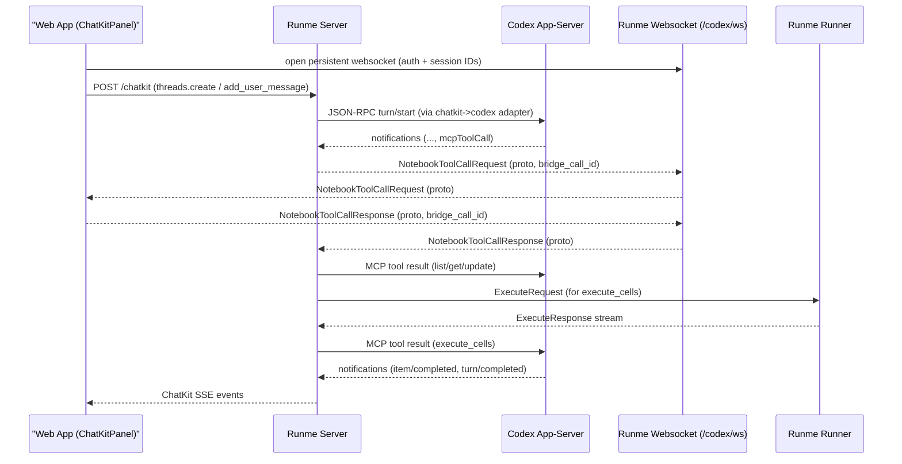

# Codex App Server Integration Design

## Summary

This doc proposes adding Codex app-server as an additional harness path for `runmedev/web` ([issue #34](https://github.com/runmedev/web/issues/34)), while keeping the existing Responses API + ChatKit path.

The design keeps notebook state and UX in the web app, keeps execution on the Runme runner, and uses Runme server as codex lifecycle manager plus NotebookService MCP host. We reuse the existing ChatKit UI/protocol surface (`/chatkit`) and swap backend harness adapters (`responses` vs `codex`). Notebook MCP tool calls are bridged to the browser over a dedicated codex websocket using proto-defined envelopes.

## Context

Today:

- The web app talks to `POST /chatkit` on Runme server.
- Runme server streams tool calls to the browser.
- Browser executes notebook tools (`ListCells`, `GetCells`, `UpdateCells`) and posts tool output back.
- Runner execution happens over the existing runner websocket (`/ws`).

Problem:

- We maintain a custom harness loop in Runme server.
- Codex app-server already provides a maintained agent harness + protocol.

Key external inputs:

- Issue: [runmedev/web#34](https://github.com/runmedev/web/issues/34)
- Codex app-server docs: [developers.openai.com/codex/app-server](https://developers.openai.com/codex/app-server)
- Codex app-server protocol (requests): [github.com/openai/codex/.../requests.ts](https://github.com/openai/codex/blob/main/codex-rs/app-server-protocol/src/protocol/requests.ts)
- Codex app-server protocol (responses): [github.com/openai/codex/.../responses.ts](https://github.com/openai/codex/blob/main/codex-rs/app-server-protocol/src/protocol/responses.ts)

## Goals

- Keep the existing Responses API + ChatKit code path fully functional.
- Add codex app-server as an optional harness path.
- Preserve current Runme notebook UX (cell list/get/update/execute).
- Keep Runme runner as the execution backend.
- Keep browser-facing auth controls in Runme server.
- Minimize protocol churn in runner websocket for v1.

## Non-Goals

- Replacing notebook storage with direct Codex mutations in Google Drive.
- Building a generic multi-agent gateway in this iteration.
- Supporting remote Runme servers controlling codex app-server on a different machine.

## Decisions

### 0. Harness selection and configuration control

We support two harness paths:

- `responses` (existing): browser `ChatKitPanel` -> Runme `/chatkit`.
- `codex` (new): browser `ChatKitPanel` -> Runme `/chatkit` (codex adapter) -> local codex app-server.

No hardcoded harness adapter default; active harness is whichever profile is set by `app.harness.setDefault(name)`.

Selection is user-configurable from App Console and persisted in `cloudAssistantSettings.harnesses` plus `cloudAssistantSettings.defaultHarness`.

Proposed App Console commands:

- `app.harness.get()` -> list configured harness profiles (`name`, `baseUrl`, `adapter`) and indicate default.
- `app.harness.update(name, baseUrl, adapter)` -> create/update a harness profile.
- `app.harness.delete(name)` -> remove a harness profile.
- `app.harness.getDefault()` -> show the default harness profile.
- `app.harness.setDefault(name)` -> set active harness profile used by ChatKit calls.

Example flow:

- `app.harness.update("local-codex", "http://localhost:1234", "codex")`
- `app.harness.update("local-responses", "http://localhost:1234", "responses")`
- `app.harness.setDefault("local-codex")`

Rationale:

- Safe incremental rollout.
- Fast fallback if codex path is unavailable on a host.
- Keeps current production behavior stable while codex path matures.

### 1. How does codex app-server get started/stopped?

Runme server owns lifecycle.

- Start lazily on first codex request by spawning `codex app-server` as a child process.
- Health check with JSON-RPC `initialize`.
- Reuse one app-server process per Runme server instance (v1), assuming a single local user session.
- Stop on Runme server shutdown (SIGINT first, then force-kill on timeout).
- Interrupt active turns with JSON-RPC `thread/interrupt` when user cancels.

Rationale: keeps local process management out of browser code and centralizes failure handling.

### 2. How does the web app communicate with codex app-server?

Through Runme server, with split control/data planes.

- Runme server talks to codex app-server over JSON-RPC on `stdio`.
- Browser keeps using `POST /chatkit` for thread/messages/tool-output events.
- Browser opens a dedicated codex bridge websocket (`/codex/ws`) for asynchronous notebook MCP tool dispatch/results.
- We do not use browser -> codex direct transport in v1.

Why not direct browser -> codex:

- Codex docs call out browser constraints; backend mediation is the stable path.
- Runme already centralizes policy, lifecycle, and observability.

### 2a. Is `/ws` the same websocket path used for execute requests?

Yes. Today `/ws` is the runner execution websocket and is run-scoped.

- Handler requires `runID`/`id` query parameters.
- Current websocket proto oneofs carry only `ExecuteRequest`/`ExecuteResponse`.
- Multiplexer currently ignores non-`ExecuteRequest` payloads.

Decision: keep `/ws` unchanged for runner execution and add separate `/codex/ws` for codex notebook MCP bridging. This avoids coupling codex session lifecycle to runner run lifecycle and minimizes regression risk.

### 2b. How many `/codex/ws` connections are allowed?

v1 assumes a single user driving codex from one browser session, so `/codex/ws` is a singleton connection.

- Allow exactly one active `/codex/ws` connection at a time.
- If a second connection arrives while one is active, reject with HTTP `409 Conflict` and a machine-readable error code (for example `codex_ws_already_connected`).
- Optional override: if `force_replace=true` is supplied at connect time, close the old connection and accept the new one.
- The bridge is not notebook-specific and not thread-specific; it carries notebook MCP tool calls for any active conversation.
- If no active bridge connection exists when a tool call arrives, fail the tool call with an explicit bridge-unavailable error.

### 3. How does codex manipulate notebooks?

By invoking NotebookService MCP tools hosted by Runme server and bridged to the active browser codex bridge connection.

- Tool definitions come from `runme/api/proto/agent/tools/v1/notebooks.proto` and generated MCP/OpenAI metadata (`toolsv1mcp`) from the redpanda MCP plugin.
- Codex emits `mcpToolCall` items for notebook actions (`ListCells`, `GetCells`, `UpdateCells`, `ExecuteCells`, ...).
- Runme implements NotebookService MCP handlers.
- For browser-owned notebook state (`List/Get/Update`), Runme forwards the tool request to browser over websocket (proto envelope), waits for browser response, then returns MCP tool result to codex.
- For execution (`ExecuteCells`), Runme reuses existing runner websocket execution flow and returns the result via MCP tool response.
- We do **not** embed ad-hoc notebook operations in item payloads; tool invocation contract is MCP.
- Server and browser correlate each tool call using a server-generated `bridge_call_id` included in request/response envelopes.

This keeps the notebook source of truth in browser while preserving codex tool semantics.

### 4. Approval policy and mutation behavior

v1 approval behavior is explicit:

- Set codex `approvalPolicy` to `never`.
- Do not show approval prompts in normal operation.
- Instruct codex to prefer notebook tools for code/command generation (`List/Get/Update/ExecuteCells` flow) so users can inspect/edit before execution.
- Allow codex file writes to the local filesystem within configured sandbox/writable roots.
- If an unexpected approval-request event is emitted by app-server, fail the operation with a clear diagnostic rather than presenting an interactive approval UI in v1.

## Why websocket relay for notebook tools?

- Tool calls are asynchronous relative to browser UI state and can occur at any point in a turn.
- Persistent websocket gives a server-push channel from Runme -> browser without polling.
- Existing Runme websocket pattern already uses proto envelopes; we reuse that pattern on `/codex/ws`.

## Architecture

## Frontend Changes (`web`)

### Reuse ChatKit panel

- Keep `ChatKitPanel` as the only chat UI.
- Keep ChatKit protocol surface to backend (`/chatkit` + SSE responses).
- Continue using existing `chatkit_state` persistence (`previous_response_id`, `thread_id`) so the codex adapter can resume turns.

### Codex bridge client/runtime

- Add codex bridge websocket client (`/codex/ws`).
- Add `CodexToolBridge` to:
  - receive `NotebookToolCallRequest` over websocket,
  - invoke notebook APIs in browser,
  - send `NotebookToolCallResponse` back over websocket.
- Open only one bridge websocket per app session; if server returns `409`, show a clear "codex bridge already connected" diagnostic.

### UI updates

- Keep panel layout unchanged (no `CodexPanel`).
- Remove `Settings.tsx`; move runtime harness configuration to App Console namespaces (`app.harness`, `oidc`, `googleClientManager`).
- Render codex-backed responses through ChatKit events returned by server adapter.
- Keep existing ChatKit tool UX for `responses`; codex MCP notebook tools flow through websocket bridge.

### App Console updates

- Extend `app` namespace with harness commands:
  - `app.harness.get()`
  - `app.harness.update(name, baseUrl, adapter)`
  - `app.harness.delete(name)`
  - `app.harness.getDefault()`
  - `app.harness.setDefault(name)`
- Persist harness profiles and default in `cloudAssistantSettings.harnesses` and `cloudAssistantSettings.defaultHarness`.
- Print active harness in `help()` output to make debugging obvious.

### Notebook integration

- Reuse existing notebook and renderer APIs for `ListCells`/`GetCells`/`UpdateCells`.
- Reuse existing websocket + runner flow for `ExecuteCells`.
- Keep notebook updates visible in real-time so user sees codex edits immediately.

## Runme Server Changes (`runme`)

### New codex package

- `pkg/agent/codex/process_manager.go`
  - spawn/monitor/stop codex app-server process
- `pkg/agent/codex/client.go`
  - JSON-RPC client + streaming decode
- `pkg/agent/codex/chatkit_adapter.go`
  - translates ChatKit request types to codex app-server turns/items and back to ChatKit SSE events
- `pkg/agent/codex/notebook_mcp.go`
  - MCP implementation of `NotebookService` backed by websocket bridge + runner
- `pkg/agent/codex/ws_handler.go`
  - websocket handler for `/codex/ws` notebook tool bridge

### Route registration

- Keep `mux.HandleProtected("/chatkit", ..., role/agent.user)` and route to harness adapter by selected default harness profile.
- Keep existing `/ws` unchanged for runner execution.
- Add codex bridge websocket route `/codex/ws` for notebook MCP dispatch/results.
- Enforce singleton `/codex/ws` policy (reject second connection unless `force_replace=true`).

### Proto changes

- Keep tool schemas in `runme/api/proto/agent/tools/v1/notebooks.proto` as the MCP source of truth.
- Add codex bridge websocket envelopes (new proto or oneof extension following existing style) with:
  - `NotebookToolCallRequest` (must include `bridge_call_id`)
  - `NotebookToolCallResponse` (must include `bridge_call_id`)
- Generate Go/TS protobuf code and wire into codex bridge websocket handler.

### Auth and policy

- Keep browser auth on `/chatkit` and `/codex/ws` using existing IAM policy checks.
- Reuse existing Agent role policy for codex harness access.
- Configure codex sessions with `approvalPolicy=never`.
- Permit file writes in codex sessions, constrained by local sandbox/writable roots.
- Bias tool choice toward notebook MCP tools so mutations are surfaced in notebook UX first.
- Codex subprocess remains local (`stdio` child process), not browser reachable.
- Notebook MCP interface is server-side (invoked by codex harness). If an HTTP MCP endpoint is ever exposed, do not rely on CORS alone; require explicit auth.

### Observability

- Add structured logs keyed by:
  - principal
  - codex session/thread/turn/item ids
  - runID (when `execute_cells` touches runner)
- Add metrics for:
  - app-server startup latency/failures
  - MCP tool-call latency/error rate
  - proxy stream disconnects

## Rollout Plan

1. Harness profiles and default selection
- Add App Console `app.harness` commands (`get/update/delete/getDefault/setDefault`).
- Persist named harness profiles with `baseUrl` + `adapter`, and select one default.

2. Codex transport + ChatKit adapter
- Add codex process manager and ChatKit->codex adapter in Runme server.
- Keep `/chatkit` as frontend protocol; select adapter from default harness profile.

3. MCP + websocket bridge
- Implement `NotebookService` MCP handlers using generated tool/proto definitions from `api/proto/agent/tools/v1/notebooks.proto`.
- Add `/codex/ws` bridge using proto-defined notebook tool request/response payloads.
- Handle `List/Get/Update` via browser bridge and return MCP tool results.

4. Codex execution path
- Support `ExecuteCells` via existing runner websocket pipeline.
- Add cancellation mapping (`thread/interrupt` + runner cancel).

5. Optional default flip
- After bake period, evaluate changing default from `responses` to `codex`.
- Keep Responses path available for fallback in this phase.

## Risks

- Codex turn/item event schema may evolve: mitigate with strict version checks (`initialize.protocolVersion`) and adapter layer.
- Multiple browser tabs may contend for singleton bridge ownership: mitigate with explicit `409` on second connect, optional `force_replace=true`, and clear UI diagnostics.
- Websocket bridge can deadlock if browser disconnects mid-toolcall: mitigate with per-tool timeout + explicit error completion to codex.
- Local codex process not installed/running: provide explicit UI diagnostics and recovery action.
- Two harnesses can drift behavior: add shared notebook contract tests that run against both `responses` and `codex`.
- Singleton websocket can cause lockout after stale disconnects: mitigate with ping/pong heartbeat + server idle timeout + pending-call failure on disconnect.

## Open Questions

- Should `execute_cells` output include full stdout/stderr or summarized result plus references?
- Which default harness profile should be created during first-run bootstrap?

## Alternative Considered: Direct Google Drive mutation

Rejected for primary flow.

- Weak real-time UX for showing codex edits in context.
- Harder conflict handling with in-memory notebook state.
- Harder to surface deterministic provenance for each codex-driven mutation.

The browser-notebook + runner execution path provides better user visibility and control.

## Appendix A: VS Code Prior Art

- Public status: OpenAI publicly documents the VS Code extension and explicitly states the extension and cloud tasks are built on codex app-server:
  - [VS Code extension docs](https://developers.openai.com/codex/ide)
  - [Codex app-server announcement](https://openai.com/index/introducing-codex/)
- App-server protocol includes `fileChange` items with `status` (`pending`, `accepted`, `rejected`) and unified diffs:
  - [Codex app-server docs](https://developers.openai.com/codex/app-server)
- App-server settings include approval/decision controls (`approvalPolicy`, `decisionMode`) and tool-level approvals:
  - [Codex app-server docs](https://developers.openai.com/codex/app-server)

Implication for Runme:

- We should preserve approval surfaces and file-change provenance in our adapter layer, rather than hiding these semantics behind opaque text streaming.
