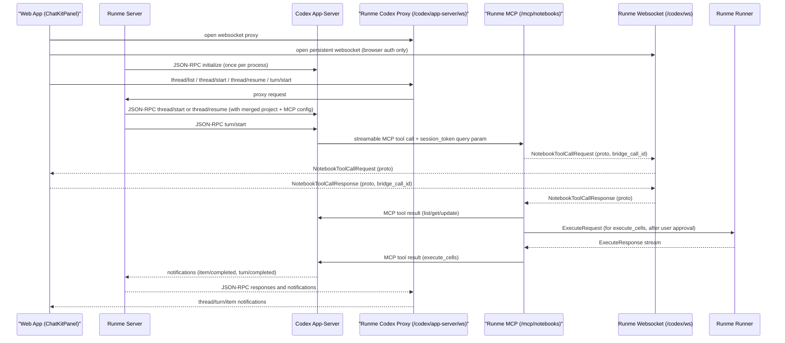

# Codex App Server Integration Design

## Summary

This doc proposes adding Codex app-server as an additional harness path for `runmedev/web` ([issue #34](https://github.com/runmedev/web/issues/34)), while keeping the existing Responses API + ChatKit path.

The design keeps notebook state and UX in the web app, keeps execution on the Runme runner, and uses Runme server as codex lifecycle manager plus NotebookService MCP host. We keep ChatKit UX, but for the Codex harness we expose a browser-facing websocket proxy for the Codex app-server protocol instead of hiding all Codex thread lifecycle behind a ChatKit-shaped HTTP adapter. Codex uses a Runme-hosted streamable MCP endpoint for notebook tools, and Runme bridges browser-owned notebook operations over a dedicated codex websocket using proto-defined envelopes.

## Context

Today:

- The web app talks to `POST /chatkit` on Runme server.
- Runme server streams tool calls to the browser.
- Browser executes notebook tools (`ListCells`, `GetCells`, `UpdateCells`) and posts tool output back.
- Runner execution happens over the existing runner websocket (`/ws`).

Problem:

- We maintain a custom harness loop in Runme server.
- Codex app-server already provides a maintained agent harness + protocol.

Key external inputs:

- Issue: [runmedev/web#34](https://github.com/runmedev/web/issues/34)
- Codex app-server docs: [developers.openai.com/codex/app-server](https://developers.openai.com/codex/app-server)
- Codex app-server protocol (requests): [github.com/openai/codex/.../requests.ts](https://github.com/openai/codex/blob/main/codex-rs/app-server-protocol/src/protocol/requests.ts)
- Codex app-server protocol (responses): [github.com/openai/codex/.../responses.ts](https://github.com/openai/codex/blob/main/codex-rs/app-server-protocol/src/protocol/responses.ts)

## Goals

- Keep the existing Responses API + ChatKit code path fully functional.
- Add codex app-server as an optional harness path.
- Preserve current Runme notebook UX (cell list/get/update/execute).
- Keep Runme runner as the execution backend.
- Keep browser-facing auth controls in Runme server.
- Minimize protocol churn in runner websocket for v1.

## Non-Goals

- Replacing notebook storage with direct Codex mutations in Google Drive.
- Building a generic multi-agent gateway in this iteration.
- Supporting remote Runme servers controlling codex app-server on a different machine.

## Decisions

### 0. Harness selection and configuration control

We support two harness paths:

- `responses` (existing): browser `ChatKitPanel` -> Runme `/chatkit`.
- `codex` (new): browser `ChatKitPanel` -> browser-side ChatKit/Codex adapter -> Runme `/codex/app-server/ws` -> local codex app-server.

Bootstrap default harness adapter is `responses`.
Active harness remains whichever profile is set by `app.harness.setDefault(name)`.

Selection is user-configurable from App Console and persisted in local storage key `runme/harness` (profiles + default harness name).

Bootstrap and initialization model:

- Add a global singleton harness manager (similar to existing singleton managers) as the source of truth for harness profiles/default.
- On app load, run harness bootstrap alongside the existing app-config preload flow:
  - attempt to load `/configs/app-configs.yaml` (same pattern as `maybeSetAppConfig()`),
  - if harness profiles are present in config, seed `runme/harness`,
  - if no harness profile config is present, create fallback profile `local-responses` with `baseUrl=window.location.origin` and `adapter=responses`, then set it as default.
- If harness profiles/default already exist in local storage, do not overwrite user-managed values.

Proposed App Console commands:

- `app.harness.get()` -> list configured harness profiles (`name`, `baseUrl`, `adapter`) and indicate default.
- `app.harness.update(name, baseUrl, adapter)` -> create/update a harness profile; `adapter` is required and must be `"responses"` or `"codex"`.
- `app.harness.delete(name)` -> remove a harness profile.
- `app.harness.getDefault()` -> show the default harness profile.
- `app.harness.setDefault(name)` -> set active harness profile used by ChatKit calls.

Example flow:

- `app.harness.update("local-codex", "http://localhost:1234", "codex")`
- `app.harness.update("local-responses", "http://localhost:1234", "responses")`
- `app.harness.setDefault("local-codex")`

Rationale:

- Safe incremental rollout.
- Fast fallback if codex path is unavailable on a host.
- Keeps current production behavior stable while codex path matures.

### 1. How does codex app-server get started/stopped?

Runme server owns lifecycle.

- Start lazily on first codex request by spawning `codex app-server` as a child process.
- Open one transport connection to the app-server and initialize it exactly once with `initialize` followed by `initialized`.
- `initialize` must include `clientInfo`; `capabilities` is optional and may be used for notification opt-outs or experimental flags.
- Reuse one app-server process and one initialized transport connection per Runme server instance (v1).
- Stop on Runme server shutdown (SIGINT first, then force-kill on timeout).
- Interrupt active turns with JSON-RPC `turn/interrupt`, keyed by both `threadId` and the last known `turnId`.

Rationale: keeps local process management out of browser code and centralizes failure handling.

### 1a. Lifecycle model: connection, threads, turns

Codex app-server's durable conversation primitive is the **thread**, not the connection.

- A **connection** is the initialized transport between Runme server and `codex app-server`. It is shared across many conversations.
- A **thread** is a conversation. Threads are persisted by Codex and can be listed, read, resumed, forked, archived, and unarchived.
- A **turn** is a single user request within a thread. Turns stream item notifications and terminate with `turn/completed`.

Implications for Runme:

- Runme does **not** need one app-server process or one transport connection per conversation.
- Runme does **not** need one app-server process per working directory.
- Runme needs one shared app-server connection and many threads on top of it.
- The browser should treat the returned `thread.id` as the durable conversation identifier.

Codex protocol lifecycle:

- Initialize once per connection.
- Start a new conversation with `thread/start`.
- Resume an existing conversation with `thread/resume`.
- Read stored conversation state without loading it using `thread/read`.
- Render history using `thread/list`.
- Send new user input with `turn/start`.
- Cancel in-flight work with `turn/interrupt`.

This matches the public Codex lifecycle documentation and is the model the Runme integration should follow.

### 1b. Working directory, model, and thread defaults

The Codex app-server treats `cwd`, `model`, approval policy, sandbox settings, and personality as thread defaults.

- `thread/start` accepts defaults such as `cwd`, `model`, `approvalPolicy`, sandbox policy, and `personality`.
- `thread/resume` may override the same defaults when reopening a stored thread.
- `turn/start` may also override these settings for a single turn; when used, they become the effective defaults for subsequent turns on that thread.

Design decision for Runme:

- Runme should treat `cwd` as a thread-level default, set when the user starts a new conversation.
- Runme should avoid silently mutating `cwd` across unrelated projects inside the same thread.
- If the user wants a different project/repository root, the UI should start a new thread in that project rather than reusing an unrelated thread.

This is a product policy choice, not a Codex protocol limitation.

### 1c. Runme projects

Codex app-server does not expose a first-class `project` object in the public protocol; it exposes thread configuration such as `cwd`.

Runme should introduce a **project** abstraction in the web app and AppKernel to make thread creation and history selection user-friendly.

Suggested project fields:

- `id`
- `name`
- `cwd`
- `model`
- `approvalPolicy`
- `sandboxPolicy`
- `personality`
- optional `writableRoots`
- optional notebook/workspace metadata

Project behavior:

- The user selects a current project in the UI.
- `New chat` starts a new Codex thread using that project's configuration.
- Conversation history is shown for the selected project by filtering `thread/list` on the project's `cwd`.
- Selecting a past conversation resumes that thread in the same project context.

This lets ChatKit present a coherent "project -> thread history -> turns" model without pretending Codex has a native project object.

### 1d. Auth and app-server-scoped MCP configuration

Runme and Codex use different identifiers and auth scopes. The integration should define them explicitly:

- A **Runme MCP auth token** is a server-issued opaque token used only for Codex-to-Runme notebook MCP calls.
- A **Codex thread** is the durable conversation id returned to the browser and used in later protocol calls.
- A **turn id** is stored per thread so `turn/interrupt(threadId, turnId)` can cancel in-flight work.

Token lifetime:

- The notebook MCP token should be treated as **app-server-scoped**, not request-scoped and not thread-scoped.
- Runme should mint it once when the app-server process/connection is initialized and reuse it for the lifetime of that app-server instance.
- In v1 the token can have an indefinite lifetime tied to the app-server process lifetime so Runme does not need token refresh logic.
- If the app-server restarts, Runme mints a new token and uses it for all subsequent threads on that process.

For the current streamable HTTP MCP integration:

- Runme injects the token into the MCP server URL as `session_token`.
- The MCP handler may also accept `Authorization: Bearer <token>` for non-Codex callers and tests, but the Codex app-server path should not rely on header injection.
- Runme must redact this token from logs and diagnostics because it travels in the query string.
- The token exists only to protect Runme MCP endpoints from arbitrary callers; it is not a user auth token and it does not identify a conversation.

### 2. How does the web app communicate with codex app-server?

Through Runme server, with split control/data planes.

- Runme server talks to codex app-server over JSON-RPC on `stdio` for control-plane thread/turn operations.
- Codex app-server talks to Runme notebook tools over a streamable MCP HTTP endpoint configured by Runme.
- We do not use a codex-managed `stdio` MCP server for notebook tools.
- Browser uses a Runme websocket proxy for Codex app-server methods and notifications (proposed path: `/codex/app-server/ws`).
- Browser opens a dedicated codex bridge websocket (`/codex/ws`) for asynchronous notebook MCP tool dispatch/results.
- We do not use browser -> codex direct transport in v1.
- For ChatKit UI compatibility, the browser also owns a small adapter layer that translates ChatKit send-message flow into Codex lifecycle calls and translates Codex notifications back into ChatKit-visible streamed events/state.

Current JSON-RPC flow:

- Runme initializes the app-server with `initialize` and `initialized`.
- Browser calls `thread/list`, `thread/read`, `thread/start`, `thread/resume`, `turn/start`, and `turn/interrupt` through the Runme websocket proxy.
- Runme forwards responses and notifications from Codex back to the browser.
- Runme intercepts `thread/start` and `thread/resume` to merge browser-selected project config with Runme-owned MCP configuration and auth.

Why not direct browser -> codex:

- Codex docs call out browser constraints; backend mediation is the stable path.
- Runme already centralizes policy, lifecycle, and observability.

Why a websocket proxy instead of plain HTTP pass-through:

- Codex turns emit asynchronous notifications after `turn/start`.
- The browser needs one transport for requests, responses, and streamed notifications.
- A websocket proxy lets the browser work against the Codex protocol directly without spawning a local Codex process.

### 2e. Where does ChatKit-to-Codex protocol conversion happen?

ChatKit UI and the Codex app-server do not speak the same protocol.

- `@openai/chatkit-react` expects ChatKit-oriented request/stream semantics.
- Codex app-server exposes JSON-RPC lifecycle methods (`thread/*`, `turn/*`) plus notifications over a websocket transport.

Current implementation:

- The browser sends ChatKit requests to Runme server.
- Runme's `/chatkit-codex` handler performs the protocol translation.

Updated design direction:

- For the Codex harness, we move that translation into the browser.
- Runme server still exposes the Codex websocket proxy at `/codex/app-server/ws`, but it is no longer responsible for re-encoding Codex notifications into ChatKit SSE for the browser.
- The browser keeps ChatKit as the visible UI, but owns a `ChatKit <-> Codex` adapter layer.

Recommended browser-side shape:

- `CodexAppServerProxyClient`
  - raw JSON-RPC websocket client for `/codex/app-server/ws`
- `CodexConversationController`
  - owns thread/turn lifecycle, current thread selection, history loading, and interrupt handling
- `codexFetchShim`
  - plugs into ChatKit's custom `fetch` hook
  - returns a synthetic `Response` with a `ReadableStream`
  - emits ChatKit-compatible SSE events derived from Codex notifications

This lets the codex path preserve the current ChatKit UI contract without requiring Runme server to keep a ChatKit-shaped codex endpoint.

### 2f. Should the browser-side adapter run in a Web Worker?

Not in v1.

- Browser `fetch` and `WebSocket` are already asynchronous and do not block the UI on their own.
- The hard part is protocol/state mapping, not CPU-heavy work.
- A Web Worker would add another protocol boundary (`postMessage`) plus token/lifecycle/debugging complexity.

Decision:

- Implement the codex adapter on the main thread first.
- Keep the design worker-compatible so it can move later if we discover UI jank or need stronger isolation.
- Do not introduce a Web Worker until the main-thread controller proves insufficient.

### 2a. Browser-facing Codex proxy API

Runme should expose a browser-facing websocket endpoint (proposed: `/codex/app-server/ws`) that speaks an app-server-like JSON-RPC protocol.

v1 proxy behavior:

- Browser sends JSON-RPC requests over the websocket.
- Runme forwards most requests and notifications unchanged.
- Runme remains protocol-aware rather than acting as a blind byte tunnel.

Methods to support first:

- `thread/list`
- `thread/read`
- `thread/start`
- `thread/resume`
- `turn/start`
- `turn/interrupt`

Methods Runme should intercept or enrich:

- `initialize`
  - Runme owns the real app-server transport lifecycle and performs this once per server-side connection.
- `thread/start`
  - merge selected project config with Runme-owned MCP config and auth
- `thread/resume`
  - reapply or validate Runme-owned MCP config when resuming a stored thread
- `turn/start`
  - optionally validate cwd/model overrides against project policy

### 2d. Does this design support concurrent conversations?

Yes, at the Codex protocol level.

- One app-server connection can host many threads.
- Each thread can be resumed independently and can hold its own defaults such as `cwd`, `model`, and sandbox settings.
- The MCP tool handlers do not need thread context. Tool calls must carry the identifiers needed to fulfill them, such as notebook id, cell ids, or similar resource identifiers.

v1 Runme limitations:

- The Codex protocol and browser-facing proxy support multiple concurrent conversations.
- Within a single browser app session, the singleton `/codex/ws` bridge is sufficient for multiple concurrent threads. A user can kick off Codex work in one thread, switch projects or threads, and start Codex work in another thread while both conversations continue to exist on the same app-server connection.
- The current bridge design assumes one active browser app owns notebook tool fulfillment. That is acceptable for v1 because notebook tool calls are conversation-agnostic and the bridge is shared across all threads in that browser app.
- Richer concurrency across multiple browser tabs, multiple browser clients, or multiple independently-owned notebook bridges will require a future bridge-routing design.

The browser should not use `@openai/codex-sdk` for this path. That SDK is designed to spawn and control a local Codex CLI process. For the web app we should instead:

- generate TypeScript protocol types with `codex app-server generate-ts`
- implement a thin browser `CodexAppServerProxyClient` over the Runme websocket proxy

### 2b. Is `/ws` the same websocket path used for execute requests?

Yes. Today `/ws` is the runner execution websocket and is run-scoped.

- Handler requires `runID`/`id` query parameters.
- Current websocket proto oneofs carry only `ExecuteRequest`/`ExecuteResponse`.
- Multiplexer currently ignores non-`ExecuteRequest` payloads.

Decision: keep `/ws` unchanged for runner execution and add separate `/codex/ws` for codex notebook MCP bridging. This avoids coupling codex session lifecycle to runner run lifecycle and minimizes regression risk.

### 2c. How many `/codex/ws` connections are allowed?

v1 assumes a single user driving codex from one browser session, so `/codex/ws` is a singleton connection.

- Allow exactly one active `/codex/ws` connection at a time.
- If a second connection arrives while one is active, reject with HTTP `409 Conflict` and a machine-readable error code (for example `codex_ws_already_connected`).
- Optional override: if `force_replace=true` is supplied at connect time, close the old connection and accept the new one.
- The bridge is not notebook-specific and not thread-specific; it carries notebook MCP tool calls for any active conversation.
- The bridge does not carry a session ID on the websocket payloads. Session scope stays on the server side, derived from the authenticated MCP request context.
- If no active bridge connection exists when a tool call arrives, fail the tool call with an explicit bridge-unavailable error.

### 3. How does codex manipulate notebooks?

By invoking NotebookService MCP tools hosted by Runme server and bridged to the active browser codex bridge connection.

- Tool definitions come from `runme/api/proto/agent/tools/v1/notebooks.proto` and generated MCP/OpenAI metadata (`toolsv1mcp`) from the redpanda MCP plugin.
- Runme exposes a streamable MCP endpoint (for example `/mcp/notebooks`) implementing `NotebookService` handlers.
- Runme mints one long-lived opaque token scoped to the Codex app-server instance.
- For the Codex app-server path, Runme injects that token into the MCP server URL as `session_token`. The MCP server validates the token and recovers the associated Runme auth scope from it.
- Codex app-server invokes notebook tools (`ListCells`, `GetCells`, `UpdateCells`, `ExecuteCells`, ...) against that streamable endpoint.
- MCP notebook tools should be conversation-agnostic. The request payload must include whatever identifiers are necessary to fulfill the request (for example notebook id, cell ids, or document references); handlers should not need to know which conversation produced the tool call.
- For browser-owned notebook state (`List/Get/Update`), Runme forwards the tool request to browser over websocket (proto envelope), waits for browser response, then returns MCP tool result to codex.
- For execution (`ExecuteCells`), Runme requires explicit user approval in the UI before execution, then reuses existing runner websocket execution flow and returns the result via MCP tool response.
- `ExecuteCells` responses return full stdout/stderr (no summarization in v1).
- We do **not** embed ad-hoc notebook operations in item payloads; tool invocation contract is MCP.
- Server and browser correlate each tool call using a server-generated `bridge_call_id` included in request/response envelopes.

This keeps the notebook source of truth in browser while preserving codex tool semantics.

### 4. Approval policy and mutation behavior

v1 approval behavior is explicit:

- Default Codex `approvalPolicy` to `never`.
- Do not surface codex approval prompts in normal operation.
- Instruct codex to prefer notebook tools for code/command generation (`List/Get/Update/ExecuteCells` flow) so users can inspect/edit before execution.
- Allow codex file writes to the local filesystem within configured sandbox/writable roots.
- If an unexpected approval-request event is emitted by app-server, fail the operation with a clear diagnostic rather than presenting an interactive approval UI in v1.
- `ExecuteCells` is separately gated by explicit user approval in Runme UI before any runner-side execution.

### 4a. Configuration ownership: what the browser chooses vs what Runme injects

Not all Codex thread settings should be owned by the same layer.

Browser/AppKernel should own user-visible defaults:

- selected project
- `cwd`
- `model`
- `personality`
- user-selectable sandbox profile, if exposed

Runme server should own security-sensitive and integration-specific config:

- notebook MCP server definitions
- MCP auth tokens
- required MCP server enforcement
- approval policy validation and allowed values
- sandbox policy validation and allowed writable roots

Design decision:

- The browser sends its desired thread configuration.
- Runme merges that desired config with server-owned configuration before forwarding `thread/start` or `thread/resume` to Codex.
- For v1, approval policy should be enforced server-side even if the browser exposes it in project configuration, because it affects security and execution semantics rather than just presentation.

## Why websocket relay for notebook tools?

- Tool calls are asynchronous relative to browser UI state and can occur at any point in a turn.
- Persistent websocket gives a server-push channel from Runme -> browser without polling.
- Existing Runme websocket pattern already uses proto envelopes; we reuse that pattern on `/codex/ws`.

## Architecture

## Frontend Changes (`web`)

### Reuse ChatKit panel

- Keep `ChatKitPanel` as the only chat UI.
- Keep `POST /chatkit` for the `responses` harness.
- For the Codex harness, add a browser-side adapter that uses the Codex websocket proxy rather than a ChatKit-shaped `/chatkit-codex` endpoint.
- The codex adapter should use ChatKit's custom `fetch` hook to return a synthetic `text/event-stream` `Response` backed by browser-side Codex lifecycle calls, not by a server-side ChatKit adapter.
- Maintain ChatKit UI state using Codex thread ids and turn ids:
  - `thread_id` is the Codex thread ID
  - `previous_response_id` is the most recent Codex turn ID

### Codex proxy client/runtime

- Add a browser `CodexAppServerProxyClient` that connects to `/codex/app-server/ws`.
- Generate TypeScript protocol types from the installed Codex version and use them in the client.
- The client must support:
  - `thread/list`
  - `thread/read`
  - `thread/start`
  - `thread/resume`
  - `turn/start`
  - `turn/interrupt`
- Turn notifications should be translated into ChatKit store updates in the browser, rather than requiring the server to re-encode them as SSE.
- Add a main-thread `CodexConversationController` that owns:
  - current thread id / latest turn id
  - `thread/start`, `thread/read`, `thread/resume`, `turn/start`, `turn/interrupt`
  - history loading for the selected project
  - conversion from Codex notifications into ChatKit-compatible streamed events
- The controller should be designed so a future Web Worker migration is possible, but v1 should keep it on the main thread.

### Codex bridge client/runtime

- Add codex bridge websocket client (`/codex/ws`).
- Add `CodexToolBridge` to:
  - receive `NotebookToolCallRequest` over websocket,
  - invoke notebook APIs in browser,
  - send `NotebookToolCallResponse` back over websocket.
- Open only one bridge websocket per app session; if server returns `409`, show a clear "codex bridge already connected" diagnostic.

### UI updates

- Keep panel layout unchanged (no `CodexPanel`).
- Add a project selector to the ChatKit header showing the active Runme project.
- Add a `New chat` action that starts a new Codex thread in the selected project.
- Show conversation history for the selected project using `thread/list` filtered by exact `cwd`.
- Selecting a history item should load it with `thread/read` and resume it with `thread/resume` before the next turn.
- Remove `Settings.tsx`; move runtime harness configuration to App Console namespaces (`app.harness`, `oidc`, `googleClientManager`, and codex project management).
- Keep existing ChatKit tool UX for `responses`; Codex notebook tools flow through the websocket bridge.

### App Console updates

- Extend `app` namespace with harness commands:
  - `app.harness.get()`
  - `app.harness.update(name, baseUrl, adapter)`
  - `app.harness.delete(name)`
  - `app.harness.getDefault()`
  - `app.harness.setDefault(name)`
- Add v0 execution-approval command:
  - `app.runCells(["cellID", "cellID"])` approves and executes the pending codex `ExecuteCells` request for those cells.
- Add Codex project commands:
  - `app.codex.project.list()`
  - `app.codex.project.create(name, cwd, model, sandboxPolicy, approvalPolicy, personality)`
  - `app.codex.project.update(id, ...)`
  - `app.codex.project.delete(id)`
  - `app.codex.project.getDefault()`
  - `app.codex.project.setDefault(id)`
- Persist harness profiles and default in local storage key `runme/harness`.
- Persist Codex projects and the default project in AppKernel/browser storage.
- Back harness commands with a global singleton harness manager so App Console, ChatKit routing, and bootstrap state stay consistent.
- Back Codex projects with a global singleton project manager so AppKernel, ChatKit routing, and history filtering stay consistent.
- Print active harness in `help()` output to make debugging obvious.

### Notebook integration

- Reuse existing notebook and renderer APIs for `ListCells`/`GetCells`/`UpdateCells`.
- For `ExecuteCells`, queue request as pending user approval, surface it in UI/App Console, and only execute after explicit user approval.
- Reuse existing websocket + runner flow for approved `ExecuteCells`.
- Return full stdout/stderr in the `ExecuteCells` MCP tool response.
- Keep notebook updates visible in real-time so user sees codex edits immediately.

## Runme Server Changes (`runme`)

### New codex package

- `pkg/agent/codex/process_manager.go`
  - spawn/monitor/stop codex app-server process
- `pkg/agent/codex/client.go`
  - JSON-RPC client + streaming decode
- `pkg/agent/codex/proxy_handler.go`
  - websocket proxy for browser-facing Codex app-server requests, responses, and notifications
- `pkg/agent/codex/notebook_mcp.go`
  - MCP implementation of `NotebookService` backed by websocket bridge + runner
- `pkg/agent/codex/ws_handler.go`
  - websocket handler for `/codex/ws` notebook tool bridge
- `pkg/agent/codex/mcp_streamable_handler.go`
  - streamable MCP HTTP handler for notebook tools with app-server-scoped token auth (query-param for Codex, bearer header also accepted)

### Route registration

- Keep `mux.HandleProtected("/chatkit", ..., role/agent.user)` for the responses handler.
- Add a browser-facing Codex proxy websocket route (proposed: `/codex/app-server/ws`).
- Keep existing `/ws` unchanged for runner execution.
- Add codex bridge websocket route `/codex/ws` for notebook MCP dispatch/results.
- Add streamable MCP route (for example `/mcp/notebooks`) used by codex app-server.
- Runme owns the real app-server `initialize` lifecycle and does not expose raw stdio to the browser.
- Enforce singleton `/codex/ws` policy (reject second connection unless `force_replace=true`).

### Proto changes

- Keep tool schemas in `runme/api/proto/agent/tools/v1/notebooks.proto` as the MCP source of truth.
- Add codex bridge websocket envelopes (new proto or oneof extension following existing style) with:
  - `NotebookToolCallRequest` (must include `bridge_call_id`)
  - `NotebookToolCallResponse` (must include `bridge_call_id`)
- Generate Go/TS protobuf code and wire into codex bridge websocket handler.

### Auth and policy

- Keep browser auth on `/chatkit`, `/codex/app-server/ws`, and `/codex/ws` using existing IAM policy checks.
- Reuse existing Agent role policy for codex harness access.
- Configure Codex threads with server-validated `approvalPolicy`.
- Permit file writes in Codex threads, constrained by local sandbox/writable roots.
- Bias tool choice toward notebook MCP tools so mutations are surfaced in notebook UX first.
- Codex subprocess remains local (`stdio` child process), not browser reachable.
- Protect the streamable MCP endpoint with app-server-scoped auth; do not rely on CORS.
- Mint one long-lived opaque token in Runme, pass it to Codex via the MCP server URL (`session_token` query parameter in v1), and validate that token on each MCP request.

### Observability

- Add structured logs keyed by:
  - principal
  - codex thread/turn/item ids
  - project id / cwd where available
  - runID (when `execute_cells` touches runner)
- Add metrics for:
  - app-server startup latency/failures
  - MCP tool-call latency/error rate
  - proxy stream disconnects

## Rollout Plan

1. Harness profiles and default selection
- Add App Console `app.harness` commands (`get/update/delete/getDefault/setDefault`).
- Persist named harness profiles with `baseUrl` + `adapter`, and select one default.
- Add bootstrap initialization using the existing app-config preload pattern; default bootstrap profile is `local-responses` at `window.location.origin`.

2. Codex transport + browser proxy
- Add codex process manager and browser-facing Codex websocket proxy in Runme server.
- Keep `/chatkit` unchanged for `responses`.
- Route selection happens client-side from harness profile `adapter` (`responses` -> `/chatkit`, `codex` -> browser-side ChatKit/Codex adapter backed by `/codex/app-server/ws` plus `/codex/ws`).

3. Projects + history UI
- Add AppKernel-managed Codex projects and a default project.
- Add project selector, `New chat`, and project-scoped history in ChatKit.
- Use `thread/list` with `cwd` filter for project history, `thread/read` for previews, and `thread/resume` for reopening stored conversations.

4. MCP + websocket bridge
- Implement `NotebookService` MCP handlers using generated tool/proto definitions from `api/proto/agent/tools/v1/notebooks.proto`.
- Add streamable MCP endpoint and app-server-scoped token mint/validation.
- Add `/codex/ws` bridge using proto-defined notebook tool request/response payloads.
- Handle `List/Get/Update` via browser bridge and return MCP tool results.

5. Codex execution path
- Add explicit user approval flow for `ExecuteCells` (v0 via App Console `app.runCells([...])`).
- Support approved `ExecuteCells` via existing runner websocket pipeline.
- Add cancellation mapping (`turn/interrupt` + runner cancel).

6. Optional default flip
- After bake period, evaluate changing default from `responses` to `codex`.
- Keep Responses path available for fallback in this phase.

## Risks

- Codex turn/item event schema may evolve: mitigate with strict version checks (`initialize.protocolVersion`) and adapter layer.
- Streamable MCP auth token leakage would expose notebook MCP endpoints: mitigate with app-server-scoped token redaction, localhost-only deployment assumptions, and explicit auth error mapping.
- Multiple browser tabs may contend for singleton bridge ownership: mitigate with explicit `409` on second connect, optional `force_replace=true`, and clear UI diagnostics.
- Concurrent notebook-backed conversations may contend for the singleton `/codex/ws` bridge: mitigate in v1 by treating the bridge as single-owner and document that richer concurrent notebook routing is future work.
- Exact-`cwd` filtering in `thread/list` can fragment history if projects are created at subdirectory granularity: mitigate by defining project `cwd` as the workspace/repository root.
- Websocket bridge can deadlock if browser disconnects mid-toolcall: mitigate with per-tool timeout + explicit error completion to codex.
- Local codex process not installed/running: provide explicit UI diagnostics and recovery action.
- Two harnesses can drift behavior: add shared notebook contract tests that run against both `responses` and `codex`.
- Singleton websocket can cause lockout after stale disconnects: mitigate with ping/pong heartbeat + server idle timeout + pending-call failure on disconnect.

## Open Questions

- None.

## Alternative Considered: Direct Google Drive mutation

Rejected for primary flow.

- Weak real-time UX for showing codex edits in context.
- Harder conflict handling with in-memory notebook state.
- Harder to surface deterministic provenance for each codex-driven mutation.

The browser-notebook + runner execution path provides better user visibility and control.

## Appendix A: VS Code Prior Art

- Public status: OpenAI publicly documents the VS Code extension and explicitly states the extension and cloud tasks are built on codex app-server:
  - [VS Code extension docs](https://developers.openai.com/codex/ide)
  - [Codex app-server announcement](https://openai.com/index/introducing-codex/)
- App-server protocol includes `fileChange` items with `status` (`pending`, `accepted`, `rejected`) and unified diffs:
  - [Codex app-server docs](https://developers.openai.com/codex/app-server)
- App-server settings include approval/decision controls (`approvalPolicy`, `decisionMode`) and tool-level approvals:
  - [Codex app-server docs](https://developers.openai.com/codex/app-server)

Implication for Runme:

- In v1 (`approvalPolicy=never` by default), we do not present codex approval prompts; we preserve file-change provenance in client/server state and logs rather than hiding semantics behind opaque text streaming.
